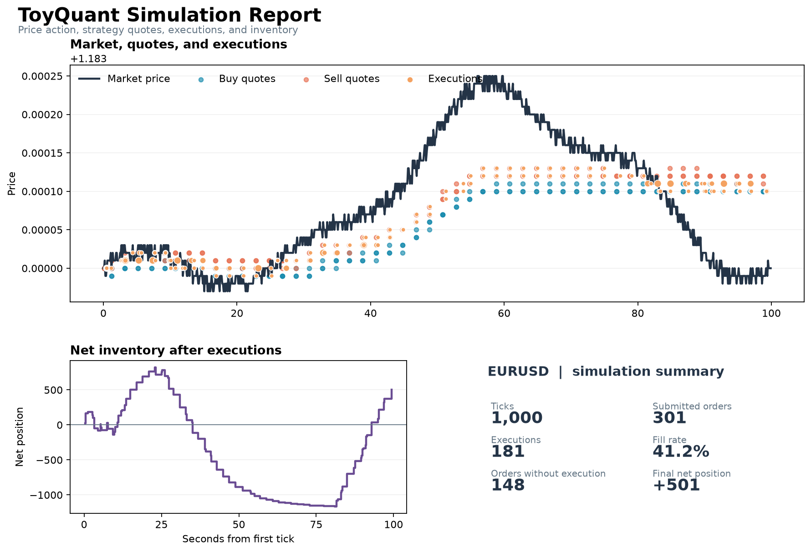

<div align="center">

# ToyQuant

**A reproducible C++20 market-making simulator — from ticks to trades to PnL.**

[](CMakeLists.txt)
[](CMakePresets.json)
[](tests)
[](LICENSE)

[User Guide](docs/USER_GUIDE.md) · [Architecture](docs/ARCHITECTURE.md) · [Scenarios](docs/SCENARIOS.md) · [Data Formats](data/README.md)

</div>

---

ToyQuant replays market data through the complete trading loop — feed, order book, strategy, matching, execution reports, and backtest metrics — so you can observe every decision a market maker makes, tick by tick.

It is a toy project for learning and experimentation, not a production trading system. APIs, scenarios, and strategy behavior may change between versions.

## Demo

```console
$ ./build/toy_quant csv data/scenarios/sample_ticks.csv 0 optimized

[TICK] EURUSD ts:1625097601900 price:1.1859 size:100 side:S | Top Bid: 1.1855@150 | Top Ask: 1.1851@50
...
[SUMMARY] submitted_orders=24 submitted_quantity=1302 cancel_requests=9
          trade_reports=11 fill_rate=0.318 cancel_rate=0.375
          net_position=-414 inventory_exposure=414 working_orders=6
```

Same input, same parameters, same output paths — the backtest log is byte-for-byte reproducible.

## How It Works

```text
 CSV scenario ──╮
                ├─► Feed ──► Order Book ──► Strategy ──► Matching Engine ──► orders.csv
 UDP stream ────╯            top of book     naive /       price–time         trades.csv
                                             optimized     priority                │
                                                                                  ▼
                                          backtest_main ──► PnL · equity · max drawdown
```

- **Two feed modes** — replay CSV scenarios or stream ticks over UDP.
- **Two market-making strategies** — `naive` and `optimized` behind a common interface.
- **Price–time priority matching** with self-trade prevention and partial fills.
- **Stateful execution reports** — position and working orders update from trade, cancel, and fill events.
- **Deterministic backtests** — realized/unrealized PnL, equity curve, and maximum drawdown.
- **No external dependencies** — CMake, a C++20 compiler, and Python 3 for the scenario tools.

## Quick Start

Requirements: CMake 3.16+, a C++20-capable compiler, and Python 3.

```bash
cmake -S . -B build
cmake --build build
ctest --test-dir build --output-on-failure
```

**Run a CSV scenario** (flat, trending, shock, and random markets ship in [data/scenarios](data/scenarios)):

```bash
./build/toy_quant csv data/scenarios/flat_ticks.csv 0 optimized
```

**Stream ticks over UDP** (and send a scenario from another terminal):

```bash
./build/toy_quant udp 9000 naive
python3 tools/udp_sender.py --port 9000
```

**Replay a backtest** from generated order and trade records:

```bash
./build/backtest_main \
  data/scenarios/synthetic_ticks.csv \
  data/runtime/orders.csv \
  data/runtime/trades.csv \
  0 0 backtest logs/backtest.log
```

Generate your own scenarios with a fixed seed for reproducible runs:

```bash
python3 tools/gen_ticks.py all --count 1000 --seed 42 --output-dir data/scenarios
```

## Output

Each `toy_quant` run creates or truncates:

- `data/runtime/orders.csv` — every order the strategy submitted.
- `data/runtime/trades.csv` — every execution report the engine returned.

The default backtest log is `logs/backtest.log`.

## Visual Report

Generate a static report with the market price, strategy quotes, executions, net inventory, and run summary:

```bash
python3 -m venv .venv
.venv/bin/python -m pip install -r requirements.txt
.venv/bin/python tools/plot_report.py \
  --ticks data/scenarios/synthetic_ticks.csv \
  --orders data/runtime/orders.csv \
  --trades data/runtime/trades.csv \
  --output reports/synthetic_ticks_optimized.png
```

The generated PNG is designed for quick inspection and README screenshots. Runtime CSV files are overwritten by the next simulation, so generate or copy the report before starting another run.



## Non-Goals

ToyQuant deliberately excludes real exchange connectivity, FIX, a risk gateway, persistence and recovery, nanosecond-latency claims, and full L2 market reconstruction. Keeping these out of scope is what keeps the core loop small enough to read in one sitting.

## Documentation

| Document | Contents |
|---|---|
| [User Guide](docs/USER_GUIDE.md) | CLI reference, data contracts, practice loop, troubleshooting |
| [Architecture](docs/ARCHITECTURE.md) | Data flow, module responsibilities, matching rules, order lifecycle |
| [Market Scenarios](docs/SCENARIOS.md) | Built-in scenarios and the tick generator |
| [Data Files](data/README.md) | Tick CSV format, runtime outputs, typical workflow |

## Contributing

Bug reports, documentation improvements, and focused tests are welcome. Please open an issue before proposing new features.

## Disclaimer

This project is for educational purposes only. It does not provide investment advice and must not be used for live trading.

---

<div align="center">
Created and maintained by <a href="https://github.com/12mango">12mango</a> · <a href="mailto:1498159938@qq.com">Contact</a> · <a href="LICENSE">MIT License</a>
</div>
