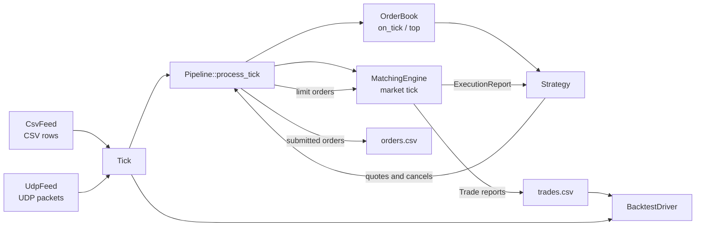
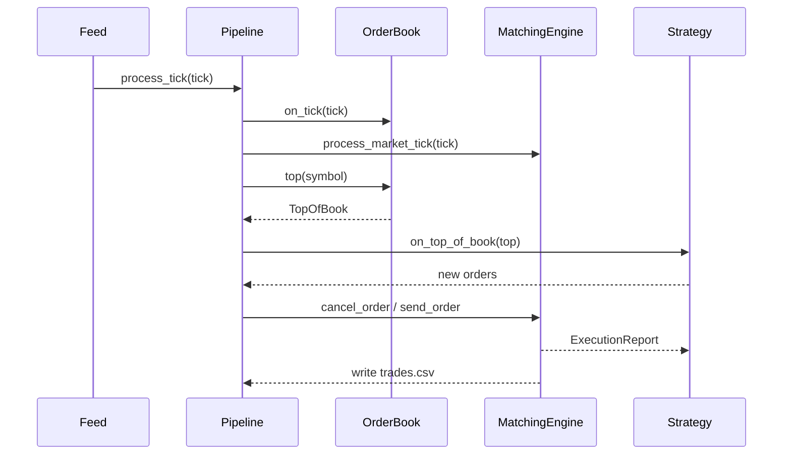
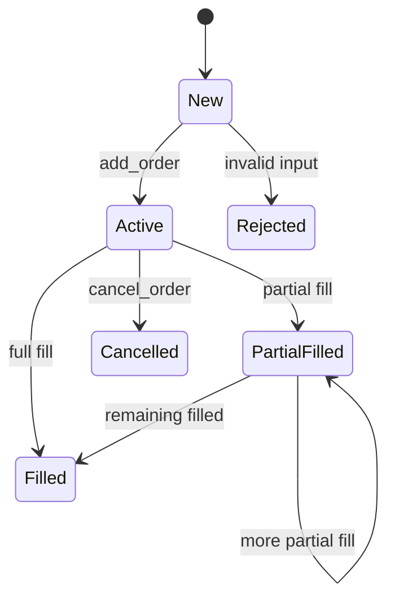
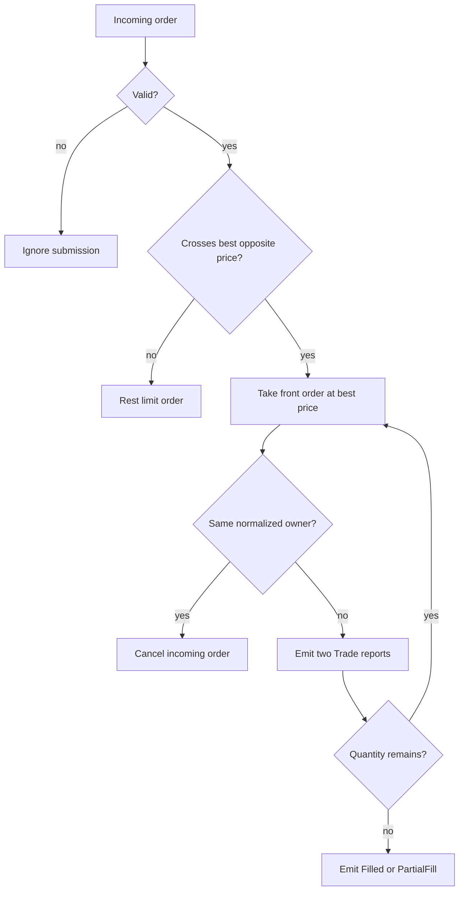
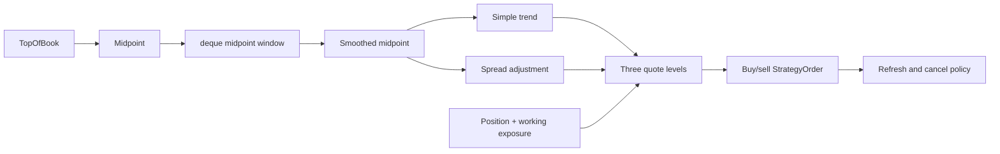

# Architecture

ToyQuant is a small event-driven market-making simulator. It connects market-data input, a simplified order book, strategy decisions, order matching, execution reports, and CSV output. This page explains the implementation by source file; [User Guide](USER_GUIDE.md) contains the commands, while [Scenarios](SCENARIOS.md) contains the input catalog.

## 1. System Map



The central path is intentionally short:

```text
input -> Tick -> OrderBook / MatchingEngine -> Strategy -> orders -> reports -> output
```

The source map is:

| Responsibility | Main files | Key types or functions |
|---|---|---|
| Shared data | `src/common/types.h` | `Tick`, `Side`, `ExecType`, `TickCallback` |
| Input | `src/market/csv_feed.*`, `udp_feed.*` | `CsvFeed::run`, `UdpFeed::loop` |
| Coordination | `src/main.cpp` | `Pipeline::process_tick`, output callbacks |
| Local state | `src/orderbook/orderbook.*` | `TopOfBook`, `OrderBook`, `OrderState` |
| Matching | `src/exchange/matching_engine.*` | `MatchingEngine::match`, `send_order` |
| Strategy | `src/strategy/strategy.h`, `market_maker.h` | `Strategy`, two market makers |
| Analysis | `src/backtest/backtest_driver.*` | `BacktestDriver::run`, `print_report` |

## 2. Shared Types and Input Boundary

### Files: `src/common/types.h`, `src/market/csv_feed.*`, `src/market/udp_feed.*`

Every feed produces the same `Tick`, so downstream modules are independent of the transport:

```cpp
struct Tick
{
    uint64_t ts = 0;
    std::string symbol;
    double price = 0.0;
    uint64_t size = 0;
    Side side = Side::Unknown;
};

using TickCallback = std::function<void(const Tick&)>;
```

`CsvFeed::run` reads one line at a time, skips the header, converts fields with `stoull` and `stod`, then invokes `cb_(t)`. A malformed row is reported and skipped. Its callback design is a C++11-style type-erased boundary: callers can provide a lambda without making the feed depend on `Pipeline`.

`UdpFeed` has a different transport but the same output contract. On Linux, `recvmmsg` receives up to eight datagrams per call. `parse_tick_cpp` uses `std::string_view` and `find` to split the packet, and the parsed tick is published into a fixed-size ring buffer:

```cpp
size_t h = head_.load(std::memory_order_relaxed);
size_t next = (h + 1) % RING_SIZE;

if (next != tail_.load(std::memory_order_acquire))
{
    ring_[h] = t;
    head_.store(next, std::memory_order_release);
}
```

The producer writes the tick before release-storing `head_`; the consumer acquire-loads the index before reading the slot. This is a single-producer/single-consumer pattern using C++11 atomics. A full ring drops the incoming tick, which is an intentional limitation of this compact feed.

The UDP implementation also shows later library choices: `std::string_view` is a C++17 non-owning view, `std::thread` owns the receiver loop, and `std::vector<std::array<char, MAX_PKT>>` provides fixed-size receive storage. The parser still constructs strings for numeric conversion, so this is not a zero-allocation parser.

## 3. Application Coordinator

### File: `src/main.cpp`, class `Pipeline`

`main.cpp` wires concrete objects together. `run_csv_mode` creates an `OrderBook`, one polymorphic strategy, a `MatchingEngine`, a `Pipeline`, and a `CsvFeed`. The feed only knows its callback; `Pipeline` owns the domain sequence.



The report callback is the other important application boundary:

```cpp
engine_.set_report_callback(
    [this](const ExecutionReport& report)
    {
        strategy_.on_order_update(report);
        write_trade_csv_row(trades_out_, report);
    });
```

The `[this]` lambda is a C++11 closure. `Pipeline` stores references to its collaborators rather than owning them; the run function constructs them in an enclosing scope and destroys them after the feed finishes. `std::unique_ptr<Strategy>` expresses exclusive ownership of the selected concrete strategy, while `std::atomic<uint64_t>` supplies the order-ID counter.

`orders.csv` is written when the pipeline submits a candidate order, before the matching result is known. `trades.csv` receives only `Trade` reports owned by `MarketMaker`; `Resting`, `Filled`, and `Cancelled` are lifecycle events, not additional executions.

## 4. OrderBook: Market View and Local Order State

### Files: `src/orderbook/orderbook.h`, `src/orderbook/orderbook.cpp`

`OrderBook` combines two pieces of state:

1. `bids_qty` and `asks_qty` provide the simplified external top of book.
2. `bids_orders` and `asks_orders` hold local strategy orders and their states.

```cpp
struct SideBook
{
    std::map<double, uint64_t, std::greater<double>> bids_qty;
    std::map<double, uint64_t> asks_qty;
    std::map<double, std::list<OrderNode>, std::greater<double>> bids_orders;
    std::map<double, std::list<OrderNode>> asks_orders;
};
```

The comparator is the key rule: `bids_qty.begin()` is the highest bid, while `asks_qty.begin()` is the lowest ask. A `std::list` keeps queue-node addresses stable when other nodes are inserted, allowing `order_index_` to point at an active `OrderNode`. This is readable ordered price-level storage; production systems often use integer ticks instead of `double` prices.

`on_tick` updates one price level from the incoming tick; `top` reads the first level on both sides. A tick does not rebuild complete depth or delete old external levels. The result is a top-of-book teaching abstraction, not a full exchange book.



`order_index_` contains active orders only. `state_index_` retains terminal states, so `state_for_order` can distinguish `Filled`, `Cancelled`, and unknown `Rejected`. `std::lock_guard<std::mutex>` protects mutations and queries with RAII: the mutex is released automatically on every return path.

## 5. MatchingEngine: Orders, Queues, and Reports

### Files: `src/exchange/order.h`, `execution_report.h`, `matching_engine.*`

The exchange namespace defines the order vocabulary. `Order` carries identity, symbol, side, limit or market type, original quantity, remaining quantity, timestamp, and owner. `ExecutionReport` adds the event type and reports either a fill or a lifecycle transition.

```cpp
struct ExecutionReport
{
    uint64_t order_id{};
    exchange::Side side{};
    ExecType exec_type{};
    std::string symbol;
    double price{};
    uint64_t quantity{};
    uint64_t ts{};
    std::string owner;
};
```

`send_order` rejects zero IDs, zero quantities, inconsistent remaining quantity, and duplicate active IDs. `process_market_tick` creates a market order owned by `Market`; that order can consume strategy liquidity but is never rested. `cancel_order` removes an active order from its price queue, updates the private `OrderBook`, and emits `Cancelled`.

The matching algorithm is a direct price-time implementation:

```cpp
auto best_ask_it = book.asks.begin();
double best_price = best_ask_it->first;
if (new_order.price < best_price) break;

Order& resting = ask_queue.front();
uint64_t traded = std::min(qty, resting.remaining);
qty -= traded;
resting.remaining -= traded;
```

For buys, ascending asks select the lowest executable price. For sells, descending bids select the highest executable price. `front()` selects the earliest order at that price. The engine reports a `Trade` for both participants, then reports `PartialFill` or `Filled` for the resting order. An unfilled incoming limit order receives `Resting` and enters the appropriate queue.



Owner normalization removes whitespace and lowercases characters. It prevents `MarketMaker` from trading against itself, but the policy cancels the aggressor and is not a general exchange standard. A subtle reporting rule is documented in `execution_report.h`: `Trade.quantity` is executed quantity; lifecycle quantities are remaining quantity.

## 6. Strategy: The Main Decision Module

### Files: `src/strategy/strategy.h`, `src/strategy/market_maker.h`

The strategy is the decision layer, not the matching layer. It sees `TopOfBook`, keeps its own working-order and position state, and returns candidate `StrategyOrder` values. The pipeline later assigns IDs and converts them to `exchange::Order`.

```cpp
class Strategy
{
   public:
    virtual ~Strategy() = default;
    virtual std::vector<StrategyOrder> on_top_of_book(
        const std::string& symbol, const TopOfBook& tob) = 0;
    virtual void on_order_submitted(const StrategyOrder& order) = 0;
    virtual std::vector<uint64_t> cancel_requests() = 0;
    virtual int64_t net_position() const = 0;
    virtual size_t working_order_count() const = 0;
    virtual void on_order_update(const ExecutionReport& report) = 0;
};
```

This interface is the key substitution point. `main.cpp` selects an implementation with `std::make_unique`, and the rest of the pipeline calls virtual functions without knowing whether it is naive or optimized. The virtual destructor makes deleting through `Strategy*` safe; pure virtual functions make the lifecycle contract explicit.

### 6.1 NaiveMarketMaker: baseline quote

The naive strategy requires both sides of the top of book, computes the midpoint, places one quote on each side, and rounds both prices to the configured tick size:

```cpp
double mid = (tob.bid_price + tob.ask_price) / 2.0;
double buy_price = std::round((mid - base_spread / 2.0) / tick_size) * tick_size;
double sell_price = std::round((mid + base_spread / 2.0) / tick_size) * tick_size;

orders.push_back(StrategyOrder(Side::Buy, symbol, buy_price, base_order_size, 0));
orders.push_back(StrategyOrder(Side::Sell, symbol, sell_price, base_order_size, 0));
```

It does not request cancellations, so its `open_orders` can accumulate. It updates `position` only from `Trade` reports and removes an order on `Filled` or `Cancelled`. This makes it a deliberately simple baseline for comparison.

### 6.2 OptimizedMarketMaker: stateful quoting

The optimized strategy adds controls in a deliberate order:



The implementation keeps recent midpoints in `std::deque<double>`. It averages the window, estimates trend as the change from the previous smoothed midpoint, and calculates up to three levels. The core inventory-aware price adjustment is:

```cpp
double raw_buy = smooth_mid - level_spread / 2.0 - std::max(0.0, trend) -
                 inv_spread_bias * (inventory > 0 ? 1.0 : 0.0);
double raw_sell = smooth_mid + level_spread / 2.0 + std::max(0.0, trend) +
                  inv_spread_bias * (inventory < 0 ? 1.0 : 0.0);

double buy_price = std::round(raw_buy / tick_size) * tick_size;
double sell_price = std::round(raw_sell / tick_size) * tick_size;
```

Inventory is `position + working_exposure`, where working buy quantities count positive and working sell quantities count negative. Positive inventory pushes buy prices lower and reduces buy size; negative inventory does the symmetric thing to sells. Once the inventory limit is exceeded, the strategy sets the risky side's quantity to zero.

The refresh policy separates “should quote now?” from “which old orders must be cancelled?”:

- `quote_age_ticks` forces refresh after an age limit.
- `quote_refresh_ticks` compares the current smoothed midpoint with `last_quote_mid`.
- `cancel_requests()` returns active IDs when the quote is stale.
- `on_order_submitted()` records IDs and resets quote age.

This is the main strategy state machine: market observations create candidate quotes, submitted IDs become working state, execution reports reduce quantities or position, and stale quotes are cancelled before replacement.

### 6.3 Execution feedback and C++ state handling

Both strategies use `std::unordered_map<uint64_t, StrategyOrder>` for direct order-ID lookup. On a `Trade`, they update position according to side and reduce the tracked quantity. On `Filled` or `Cancelled`, they erase the working order. `Resting` and `PartialFill` are lifecycle notifications in the current implementation and do not directly change position.

The strategy module demonstrates C++11 ownership and polymorphism (`std::unique_ptr`, virtual interfaces, and lambdas in the surrounding pipeline), C++14-era container-oriented style, C++17 library types, and C++20 usage in the surrounding project such as `unordered_map::contains` and designated report initialization. The important lesson is how each feature makes ownership, lookup, or event flow explicit.

## 7. Backtest: Replay, PnL, and Limits

### Files: `src/backtest/backtest_driver.h`, `backtest_driver.cpp`

`BacktestDriver` is an offline analysis component. It reads ticks to establish the final mark price, reads the recorded trade CSV, applies slippage and fees, updates per-symbol positions, and writes a report. It does not participate in live order matching.

```cpp
double exec_price = trade.price +
    (trade.side == Side::Buy ? slippage_ : -slippage_);
double fee = trade.quantity * exec_price * fee_rate_;

auto& pos = positions[trade.symbol];
```

The PnL logic uses a **net-position** model. `Position::qty` is signed: a positive value is net long, a negative value is net short, and zero is flat. A buy first closes an existing short; a sell first closes an existing long. Only any quantity left after that close opens or extends the opposite net position. The implementation therefore supports simultaneous buy and sell *orders*, but it does not keep separate long and short inventory ledgers for the same symbol.

`Position` also stores the average entry price of the current net position. Closing quantity contributes to `realized_pnl`; remaining open quantity contributes unrealized PnL when it is marked against the latest tick price. The driver clears positions, prices, realized PnL, and the equity curve at the beginning of `run()`, then sorts symbols before reporting to avoid unstable `unordered_map` output order. The current equity curve receives only the final equity value, so maximum drawdown is not a per-tick risk series yet. The `orders_file` constructor argument remains for CLI compatibility but is not currently read.

## 8. C++ Feature Map and Reading Order

| Standard | Feature visible in this project | Where to inspect it |
|---|---|---|
| C++11 | lambdas, `std::thread`, atomics, mutex RAII, `unique_ptr`, `enum class` | `src/main.cpp`, `src/market/udp_feed.cpp`, `src/common/types.h` |
| C++14 | modern factory and container-oriented implementation style | `src/main.cpp`, `src/strategy/market_maker.h` |
| C++17 | `std::filesystem`, `std::string_view`, structured bindings | `src/main.cpp`, `src/market/udp_feed.cpp`, `src/backtest/backtest_driver.cpp` |
| C++20 | `unordered_map::contains`, designated initializers, strict `from_chars` parsing | `src/exchange/matching_engine.cpp`, `src/main.cpp` |

For a code-reading pass, follow this order:

1. `src/common/types.h` for the shared vocabulary.
2. `src/main.cpp` for object construction and event order.
3. `src/strategy/strategy.h` and `market_maker.h` for decisions and state.
4. `src/orderbook/` and `src/exchange/` for storage and matching rules.
5. `src/backtest/` for offline performance calculation.
6. `tests/` to see the intended observable behavior.

The project intentionally does not model full depth, real exchange protocols, persistence and recovery, risk gateways, queue position, or production latency. Those are boundaries, not hidden guarantees. The value of this codebase is that one complete market-making path remains visible enough to study.
