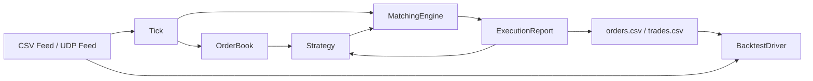

# Architecture

## Data Flow

## Module Responsibilities

| Module | Main files | Responsibility |
|---|---|---|
| Market data | `src/market/` | Converts CSV or UDP messages into `Tick` values. |
| Order book | `src/orderbook/` | Stores local order state and computes top-of-book prices and quantities. |
| Strategy | `src/strategy/` | Creates quotes from `TopOfBook` and maintains positions and working orders. |
| Matching engine | `src/exchange/` | Accepts limit orders and external ticks, then applies price-time priority. |
| Application | `src/main.cpp` | Connects the feed, order book, strategy, matching engine, and CSV output. |
| Backtest | `src/backtest/` | Calculates positions, PnL, fees, slippage, and drawdown from tick and trade CSV files. |

## Processing One Tick

1. `CsvFeed` or `UdpFeed` produces a `Tick`.
2. `OrderBook::on_tick` updates the external top of book.
3. `MatchingEngine::process_market_tick` treats the tick as external liquidity and tries to fill local resting orders.
4. The strategy reads `TopOfBook`, decides whether to cancel, and creates new orders.
5. The application assigns strategy order IDs, writes `orders.csv`, and sends orders to the matching engine.
6. The engine emits `ExecutionReport` values. The strategy updates positions and working orders; the application writes trades to `trades.csv`.

## Matching Rules

- Buy orders match the lowest ask; sell orders match the highest bid.
- Each price level uses a `std::list` queue, so earlier resting orders fill first.
- Orders with the same `owner` cannot match each other; the aggressive order receives a cancellation report.
- A valid limit order that cannot be filled becomes a resting order.
- Order ID, quantity, and remaining quantity are validated before entering the engine and order book to prevent duplicate orders or overfills from corrupting state.

## Design Boundaries

This project maintains a simplified order book for learning: `OrderBook` stores local orders and the top of book derived from ticks, while `MatchingEngine` owns separate matching price levels. Order submission, fills, and cancellations keep the two views synchronized.

The model intentionally omits queue position, full market depth, matching partitions, network replay, clock synchronization, and persistence/recovery found in production systems.
