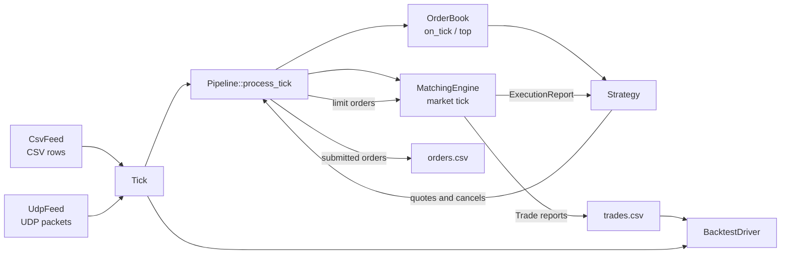
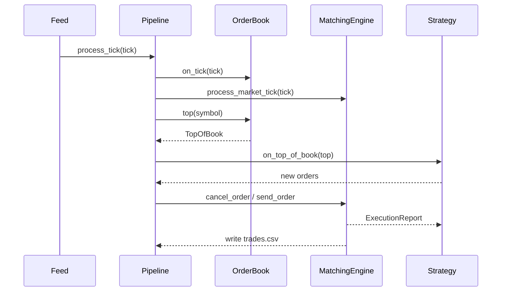
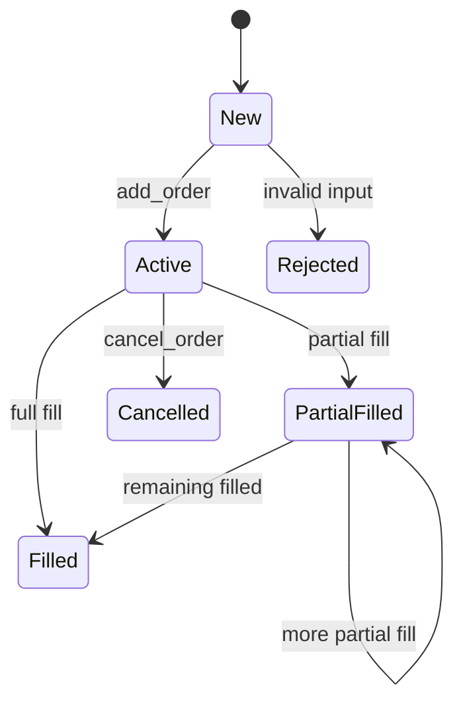
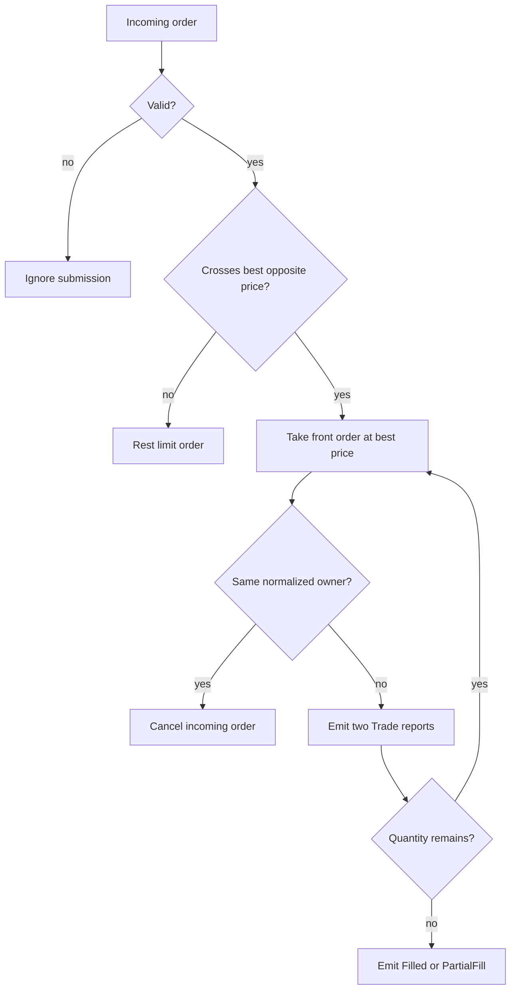
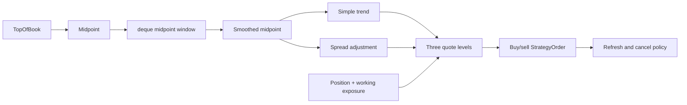

# Architecture

ToyQuant is a small event-driven market-making simulator. It connects market-data input, a simplified order book, strategy decisions, order matching, execution reports, and CSV output. This page explains the implementation by source file; [User Guide](USER_GUIDE.md) contains the commands, scenarios, and experiment workflow.

## 1. System Map



The central path is intentionally short:

```text
input -> Tick -> OrderBook / MatchingEngine -> Strategy -> orders -> reports -> output
```

The source map is:

| Responsibility | Main files | Key types or functions |
|---|---|---|
| Shared data | `src/common/types.h` | `Tick`, `Side`, `ExecType`, `TickCallback` |
| Input | `src/market/csv_feed.*`, `udp_feed.*` | `CsvFeed::run`, `UdpFeed::loop` |
| Coordination | `src/main.cpp` | `Pipeline::process_tick`, output callbacks |
| Local state | `src/orderbook/orderbook.*` | `TopOfBook`, `OrderBook`, `OrderState` |
| Matching | `src/exchange/matching_engine.*` | `MatchingEngine::match`, `send_order` |
| Strategy | `src/strategy/strategy.h`, `market_maker.h` | `Strategy`, two market makers |
| Analysis | `src/backtest/backtest_driver.*` | `BacktestDriver::run`, `print_report` |
| Runtime logging | `src/utils/logger.*` | `Logger::log`, `Logger::error` |

## 2. Shared Types and Input Boundary

**Files:** `src/common/types.h`, `src/market/csv_feed.*`, `src/market/udp_feed.*`

Every feed produces the same `Tick`, so downstream modules are independent of the transport:

```cpp
struct Tick
{
    uint64_t ts = 0;
    std::string symbol;
    double price = 0.0;
    uint64_t size = 0;
    Side side = Side::Unknown;
};

using TickCallback = std::function<void(const Tick&)>;
```

`CsvFeed::run` reads one line at a time, skips the header, converts fields with `stoull` and `stod`, then invokes `cb_(t)`. A malformed row is reported and skipped. Its callback design is a C++11-style type-erased boundary: callers can provide a lambda without making the feed depend on `Pipeline`.

`UdpFeed` has a different transport but the same output contract. On Linux, `recvmmsg` receives up to eight datagrams per call. `parse_tick_cpp` uses `std::string_view` and `find` to split the packet, and the parsed tick is published into a fixed-size ring buffer:

```cpp
size_t h = head_.load(std::memory_order_relaxed);
size_t next = (h + 1) % RING_SIZE;

if (next != tail_.load(std::memory_order_acquire))
{
    ring_[h] = t;
    head_.store(next, std::memory_order_release);
}
```

The producer writes the tick before release-storing `head_`; the consumer acquire-loads the index before reading the slot. This is a single-producer/single-consumer pattern using C++11 atomics. A full ring drops the incoming tick, which is an intentional limitation of this compact feed.

The UDP implementation also shows later library choices: `std::string_view` is a C++17 non-owning view, `std::thread` owns the receiver loop, and `std::vector<std::array<char, MAX_PKT>>` provides fixed-size receive storage. The parser still constructs strings for numeric conversion, so this is not a zero-allocation parser.

## 3. Application Coordinator

### File: `src/main.cpp`, class `Pipeline`

`main.cpp` wires concrete objects together. `run_csv_mode` creates an `OrderBook`, one polymorphic strategy, a `MatchingEngine`, a `Pipeline`, and a `CsvFeed`. The feed only knows its callback; `Pipeline` owns the domain sequence.



The report callback is the other important application boundary:

```cpp
engine_.set_report_callback(
    [this](const ExecutionReport& report)
    {
        strategy_.on_order_update(report);
        write_trade_csv_row(trades_out_, report);
    });
```

The `[this]` lambda is a C++11 closure. `Pipeline` stores references to its collaborators rather than owning them; the run function constructs them in an enclosing scope and destroys them after the feed finishes. `std::unique_ptr<Strategy>` expresses exclusive ownership of the selected concrete strategy, while `std::atomic<uint64_t>` supplies the order-ID counter.

`orders.csv` is written when the pipeline submits a candidate order, before the matching result is known. `trades.csv` receives only `Trade` reports owned by `MarketMaker`; `Resting`, `Filled`, and `Cancelled` are lifecycle events, not additional executions.

### 3.1 Dependency injection at the coordinator boundary

`Pipeline` does not construct the order book, strategy, matching engine, or output streams itself. They are created by `run_csv_mode` and passed into the constructor:

```cpp
auto output_files = open_output_files();
OrderBook order_book;
auto strategy = make_strategy(cfg.strategy_name);
Logger logger(to_abs_path("logs/toy_quant.log"));
MatchingEngine engine(&logger);
Pipeline pipeline(output_files.orders, output_files.trades, order_book, *strategy, engine, logger);
```

The constructor receives the domain collaborators through their interfaces and stores references to them:

```cpp
Pipeline(std::ofstream& orders_out, std::ofstream& trades_out, IOrderBook& order_book,
                 Strategy& strategy, IMatchingEngine& engine, Logger& logger)
    : orders_out_(orders_out),
      trades_out_(trades_out),
      order_book_(order_book),
      strategy_(strategy),
            engine_(engine),
            logger_(logger)
{
    // Install the report boundary after the collaborators are available.
}
```

This is constructor injection: the `Pipeline` declares what it needs, while the caller chooses the concrete implementations. `IOrderBook` and `IMatchingEngine` make the coordinator depend on behavior rather than on `OrderBook` and `MatchingEngine` details. The strategy is injected through the `Strategy` base class, so the same pipeline can run `NaiveMarketMaker` or `OptimizedMarketMaker`:

```cpp
std::unique_ptr<Strategy> make_strategy(const std::string& strategy_name)
{
    if (strategy_name == "naive")
    {
        return std::make_unique<NaiveMarketMaker>(100, 0.00001);
    }
    return std::make_unique<OptimizedMarketMaker>(100, 0.000003);
}
```

Dependency injection keeps the event sequence in one place without making `Pipeline` responsible for configuration, construction, or ownership of every component. It also gives tests a narrow substitution point: a fake `IOrderBook`, `IMatchingEngine`, or `Strategy` can record calls and verify that `process_tick` sends market data, cancellations, and orders in the expected order. The same design is used for the feed callback: `CsvFeed` receives a `TickCallback`, so it publishes ticks without depending on the `Pipeline` class.

### 3.2 RAII and lifetime-bound resources

The application uses RAII, or Resource Acquisition Is Initialization, to bind cleanup to object lifetime. In CSV mode, the local objects are created in dependency order and remain alive while the feed invokes the pipeline:

```cpp
auto output_files = open_output_files();
OrderBook order_book;
auto strategy = make_strategy(cfg.strategy_name);
Logger logger(to_abs_path("logs/toy_quant.log"));
MatchingEngine engine(&logger);
Pipeline pipeline(output_files.orders, output_files.trades, order_book, *strategy, engine, logger);
CsvFeed feed(csv_file, [&](const Tick& tick) { pipeline.process_tick(tick, true); }, cfg.delay,
             &logger);
feed.run();
```

When `run_csv_mode` returns, destruction runs in reverse declaration order. `feed` is destroyed first, then `pipeline`, `engine`, `strategy`, `order_book`, and finally `output_files`; the `std::ofstream` members flush and close without an explicit cleanup path. If `feed.run()` or another operation throws, stack unwinding still performs the same destruction. This is why the callback must not outlive `pipeline`, and why the enclosing scope deliberately owns all of them together.

The locking code applies the same rule to synchronization:

```cpp
TopOfBook OrderBook::top(const std::string& symbol)
{
    std::lock_guard<std::mutex> lock(mtx_);
    // Read the protected book state and return a snapshot.
}
```

Constructing `lock` acquires `mtx_`; leaving the function releases it automatically, including early returns such as an unknown symbol. The same pattern protects `on_tick`, `add_order`, `cancel_order`, and fill updates. RAII therefore handles both external resources such as files and internal resources such as mutex ownership, making exceptional and multi-return control flow less error-prone. `std::unique_ptr<Strategy>` is another ownership example: it destroys the selected concrete strategy through the virtual destructor when its scope ends.

### 3.3 Unified runtime logging

**Files:** `src/utils/logger.h`, `src/utils/logger.cpp`

`Logger` owns the optional text log file and mirrors each message to the appropriate console stream. `log(...)` writes to `stdout`; `error(...)` writes to `stderr`. When an application supplies a file path, the constructor creates its parent directory, opens the file in truncate mode for the current run, and `write` copies every message to that file. An empty path preserves console output without opening a file.

The application entry points own the `Logger`: CSV and UDP runs use `logs/toy_quant.log`, while `backtest_main` uses its configurable backtest log path. They pass it to the components that emit runtime events. `Pipeline` and `BacktestDriver` require `Logger&`, because their lifetime is always within the entry point's logging scope. `CsvFeed` and `MatchingEngine` accept an optional `Logger*`, preserving standalone construction for narrow tests and other callers:

```cpp
Logger logger(to_abs_path("logs/toy_quant.log"));
MatchingEngine engine(&logger);
CsvFeed feed(path, callback, delay, &logger);
```

This is dependency injection rather than a global logger. Market data, matching, and backtesting describe events but do not decide file locations, create directories, or manage file streams. `orders.csv` and `trades.csv` remain separate: they are structured business records consumed by the backtest, not human-readable runtime logs.

`Logger` uses a variadic template so callers can stream several values without manually constructing a temporary string:

```cpp
template <typename... Args>
void log(Args&&... args)
{
    write(format(std::forward<Args>(args)...), std::cout);
}
```

`typename... Args` declares a template parameter pack: at each call, the compiler deduces zero or more argument types. For example, `logger.log("order=", id, " qty=", quantity)` deduces types for the string literals and numeric values. `Args&&...` is a forwarding-reference parameter pack, and `std::forward<Args>(args)...` preserves whether each argument was an lvalue or rvalue when passing it to `format`.

Inside `format`, the fold expression `(stream << ... << args)` expands the pack into chained stream insertions. The example above is conceptually `stream << "order=" << id << " qty=" << quantity`. The resulting `std::string` lets the non-template `write` method implement the destination policy only once. The template definitions remain in the header because the compiler must see their bodies when it instantiates them for each argument combination.

## 4. OrderBook: Market View and Local Order State

**Files:** `src/orderbook/orderbook.h`, `src/orderbook/orderbook.cpp`

`OrderBook` combines two pieces of state:

1. `bids_qty` and `asks_qty` provide the simplified external top of book.
2. `bids_orders` and `asks_orders` hold local strategy orders and their states.

```cpp
struct SideBook
{
    std::map<double, uint64_t, std::greater<double>> bids_qty;
    std::map<double, uint64_t> asks_qty;
    std::map<double, std::list<OrderNode>, std::greater<double>> bids_orders;
    std::map<double, std::list<OrderNode>> asks_orders;
};
```

The comparator is the key rule: `bids_qty.begin()` is the highest bid, while `asks_qty.begin()` is the lowest ask. A `std::list` keeps queue-node addresses stable when other nodes are inserted, allowing `order_index_` to point at an active `OrderNode`. This is readable ordered price-level storage; production systems often use integer ticks instead of `double` prices.

`on_tick` updates one price level from the incoming tick; `top` reads the first level on both sides. A tick does not rebuild complete depth or delete old external levels. The result is a top-of-book teaching abstraction, not a full exchange book.



`order_index_` contains active orders only. `state_index_` retains terminal states, so `state_for_order` can distinguish `Filled`, `Cancelled`, and unknown `Rejected`. `std::lock_guard<std::mutex>` protects mutations and queries with RAII: the mutex is released automatically on every return path.

### 4.1 Why `map` and `unordered_map` are both present

`OrderBook` mixes two access patterns:

```cpp
std::map<std::string, SideBook> books_;
std::unordered_map<uint64_t, OrderNode*> order_index_;
std::unordered_map<uint64_t, OrderState> state_index_;
```

The `map` versions are used when the code needs ordered iteration by price or symbol. `books_` is keyed by symbol, and each `SideBook` keeps price levels in sorted order:

```cpp
std::map<double, uint64_t, std::greater<double>> bids_qty;
std::map<double, std::list<OrderNode>, std::greater<double>> bids_orders;
```

This makes `bids_qty.begin()` the best bid and `asks_qty.begin()` the best ask, which is exactly what `top()` wants. The downside is that `std::map` is $O(\log n)$ for lookup and iteration is ordered by key.

`unordered_map` is used for order IDs and states, because the code mostly needs direct lookup and duplicate checks:

```cpp
auto it = order_index_.find(order_id);
if (it == order_index_.end()) return false;
```

and

```cpp
if (state_index_.contains(order.id))
{
    return;
}
```

Here the goal is not ordering but constant-time average lookup: `unordered_map` is $O(1)$ average, which is useful when a fill, cancel, or state transition needs to find one active order by ID. In other words, the project chooses `map` for “sorted market view” and `unordered_map` for “fast order identity lookup.”

### 4.2 Precision and the future integer conversion

The current book uses `double` for prices, which is simple and readable but not ideal for exchange-grade precision:

```cpp
std::map<double, uint64_t, std::greater<double>> bids_qty;
```

A value like `99.999999` can exist as a floating-point artifact, especially after repeated calculations or normalization. That is acceptable in a teaching project, but not ideal for deterministic matching or backtesting.

The natural next step is to move the book to integer ticks at the boundary. Instead of storing raw `double` prices, the code would convert prices to integer ticks before inserting them into the book, e.g.:

```cpp
long long tick_price = static_cast<long long>(std::llround(raw_price / tick_size));
```

Then comparisons and ordering remain exact, and the rest of the order book can keep the same logic while avoiding floating-point drift. In real exchange systems this is the standard pattern: the book is built on integer ticks, while the display layer converts back to human-readable prices. This project keeps `double` for simplicity, but the architecture already points toward that later optimization.

## 5. MatchingEngine: Orders, Queues, and Reports

**Files:** `src/exchange/order.h`, `execution_report.h`, `matching_engine.*`

The exchange namespace defines the order vocabulary. `Order` carries identity, symbol, side, limit or market type, original quantity, remaining quantity, timestamp, and owner. `ExecutionReport` adds the event type and reports either a fill or a lifecycle transition.

```cpp
struct ExecutionReport
{
    uint64_t order_id{};
    exchange::Side side{};
    ExecType exec_type{};
    std::string symbol;
    double price{};
    uint64_t quantity{};
    uint64_t ts{};
    std::string owner;
};
```

Three details matter here:

- External ticks become `Market` orders via `process_market_tick`, so they can consume strategy liquidity but are never rested.
- Each price level uses `std::list<exchange::Order>` to keep FIFO order, and `front()` / `pop_front()` implement price-time priority.
- The engine normalizes `owner` before comparing resting and incoming orders, which prevents `MarketMaker` from trading with itself.

The matching algorithm is a direct price-time implementation:

```cpp
auto best_ask_it = book.asks.begin();
double best_price = best_ask_it->first;
if (new_order.price < best_price) break;

Order& resting = ask_queue.front();
uint64_t traded = std::min(qty, resting.remaining);
qty -= traded;
resting.remaining -= traded;
```

For buys, ascending asks select the lowest executable price. For sells, descending bids select the highest executable price. `front()` selects the earliest order at that price. The engine reports a `Trade` for both participants, then reports `PartialFill` or `Filled` for the resting order. An unfilled incoming limit order receives `Resting` and enters the appropriate queue.



Owner normalization removes whitespace and lowercases characters. It prevents `MarketMaker` from trading against itself, but the policy cancels the aggressor and is not a general exchange standard. A subtle reporting rule is documented in `execution_report.h`: `Trade.quantity` is executed quantity; lifecycle quantities are remaining quantity.

## 6. Strategy: The Main Decision Module

**Files:** `src/strategy/strategy.h`, `src/strategy/market_maker.h`

The strategy is the decision layer, not the matching layer. It sees `TopOfBook`, keeps its own working-order and position state, and returns candidate `StrategyOrder` values. The pipeline later assigns IDs and converts them to `exchange::Order`.

```cpp
class Strategy
{
   public:
    virtual ~Strategy() = default;
    virtual std::vector<StrategyOrder> on_top_of_book(
        const std::string& symbol, const TopOfBook& tob) = 0;
    virtual void on_order_submitted(const StrategyOrder& order) = 0;
    virtual std::vector<uint64_t> cancel_requests() = 0;
    virtual int64_t net_position() const = 0;
    virtual size_t working_order_count() const = 0;
    virtual void on_order_update(const ExecutionReport& report) = 0;
};
```

This interface is the key substitution point. `main.cpp` selects an implementation with `std::make_unique`, and the rest of the pipeline calls virtual functions without knowing whether it is naive or optimized. The virtual destructor makes deleting through `Strategy*` safe; pure virtual functions make the lifecycle contract explicit.

### 6.1 NaiveMarketMaker: baseline quote

The naive strategy requires both sides of the top of book, computes the midpoint, places one quote on each side, and rounds both prices to the configured tick size:

```cpp
double mid = (tob.bid_price + tob.ask_price) / 2.0;
double buy_price = std::round((mid - base_spread / 2.0) / tick_size) * tick_size;
double sell_price = std::round((mid + base_spread / 2.0) / tick_size) * tick_size;

orders.push_back(StrategyOrder(Side::Buy, symbol, buy_price, base_order_size, 0));
orders.push_back(StrategyOrder(Side::Sell, symbol, sell_price, base_order_size, 0));
```

It does not request cancellations, so its `open_orders` can accumulate. It updates `position` only from `Trade` reports and removes an order on `Filled` or `Cancelled`. This makes it a deliberately simple baseline for comparison.

### 6.2 OptimizedMarketMaker: stateful quoting

The optimized strategy adds controls in a deliberate order:



The implementation keeps recent midpoints in `std::deque<double>`. It averages the window, estimates trend as the change from the previous smoothed midpoint, and calculates up to three levels. The core inventory-aware price adjustment is:

```cpp
double raw_buy = smooth_mid - level_spread / 2.0 - std::max(0.0, trend) -
                 inv_spread_bias * (inventory > 0 ? 1.0 : 0.0);
double raw_sell = smooth_mid + level_spread / 2.0 + std::max(0.0, trend) +
                  inv_spread_bias * (inventory < 0 ? 1.0 : 0.0);

double buy_price = std::round(raw_buy / tick_size) * tick_size;
double sell_price = std::round(raw_sell / tick_size) * tick_size;
```

Inventory is `position + working_exposure`, where working buy quantities count positive and working sell quantities count negative. Positive inventory pushes buy prices lower and reduces buy size; negative inventory does the symmetric thing to sells. Once the inventory limit is exceeded, the strategy sets the risky side's quantity to zero.

The refresh policy separates “should quote now?” from “which old orders must be cancelled?”:

- `quote_age_ticks` forces refresh after an age limit.
- `quote_refresh_ticks` compares the current smoothed midpoint with `last_quote_mid`.
- `cancel_requests()` returns active IDs when the quote is stale.
- `on_order_submitted()` records IDs and resets quote age.

This is the main strategy state machine: market observations create candidate quotes, submitted IDs become working state, execution reports reduce quantities or position, and stale quotes are cancelled before replacement.

### 6.3 Strategy comparison

For the same `sample_ticks.csv` run, the two strategies diverge immediately:

| Strategy | Submitted orders | Submitted quantity | Cancel requests | Fill rate | Net position | Current equity |
|---|---:|---:|---:|---:|---:|---:|
| `naive` | 38 | 3800 | 0 | 0.231579 | -880 | -0.713200 |
| `optimized` | 24 | 1379 | 9 | 0.31037 | -428 | -0.329810 |

The table shows the core difference: `naive` is more aggressive and leaves more working orders behind, while `optimized` submits less, cancels stale quotes, and ends with a smaller adverse position. That is why the optimized version is the better demonstration of stateful market making in this project.

## 7. Backtest and Performance Metrics

**Files:** `src/backtest/backtest_driver.h`, `backtest_driver.cpp`

`BacktestDriver` is an offline analysis component. It reads ticks to establish the final mark price, reads the recorded trade CSV, applies slippage and fees, updates per-symbol positions, and writes a report. It does not participate in live order matching.

```cpp
double exec_price = trade.price +
    (trade.side == Side::Buy ? slippage_ : -slippage_);
double fee = trade.quantity * exec_price * fee_rate_;

auto& pos = positions[trade.symbol];
```

The PnL logic uses a **net-position** model. `Position::qty` is signed: a positive value is net long, a negative value is net short, and zero is flat. A buy first closes an existing short; a sell first closes an existing long. Only any quantity left after that close opens or extends the opposite net position. The implementation therefore supports simultaneous buy and sell *orders*, but it does not keep separate long and short inventory ledgers for the same symbol.

`Position` also stores the average entry price of the current net position. Closing quantity contributes to `realized_pnl`; remaining open quantity contributes unrealized PnL when it is marked against the latest tick price. The current equity curve receives only the final equity value, so maximum drawdown is not a per-tick risk series yet. The `orders_file` constructor argument remains for CLI compatibility but is not currently read.

**Files:** `src/backtest/performance.*`, `tests/performance_test.cpp`

The reusable `metrics` module keeps calculations independent from both the live pipeline and `BacktestDriver`. The CSV/UDP pipeline uses it for execution summary values, while the backtest uses it for maximum drawdown:

| Metric | Meaning | Current consumer |
|---|---|---|
| `fill_rate` | Filled quantity divided by submitted quantity | `main.cpp` execution summary |
| `cancel_rate` | Cancel requests divided by submitted orders | `main.cpp` execution summary |
| `inventory_exposure` | Absolute value of net position | `main.cpp` execution summary |
| `max_drawdown` | Largest decline from an equity peak | `BacktestDriver` |

The metric tests cover zero denominators, positive and negative inventory, empty equity curves, and a known peak-to-trough drawdown. This separation lets future metrics be added without expanding `backtest_driver.h` or duplicating formulas in `main.cpp`.

