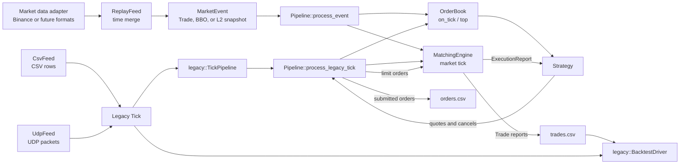
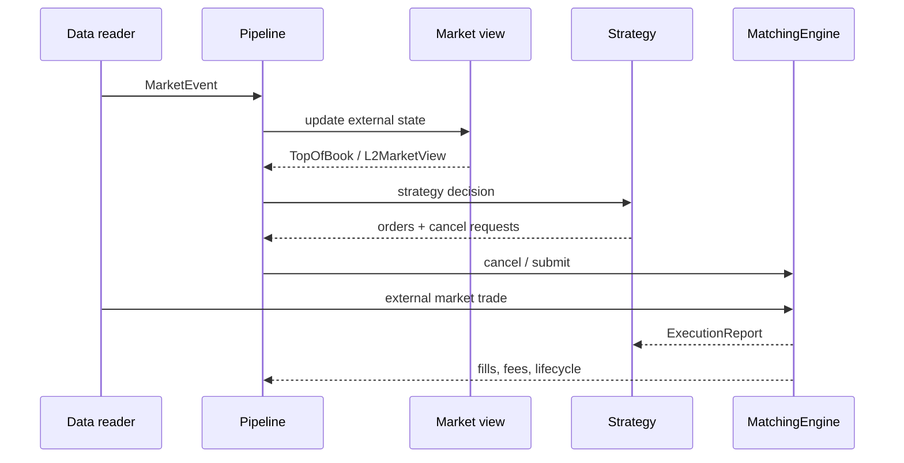
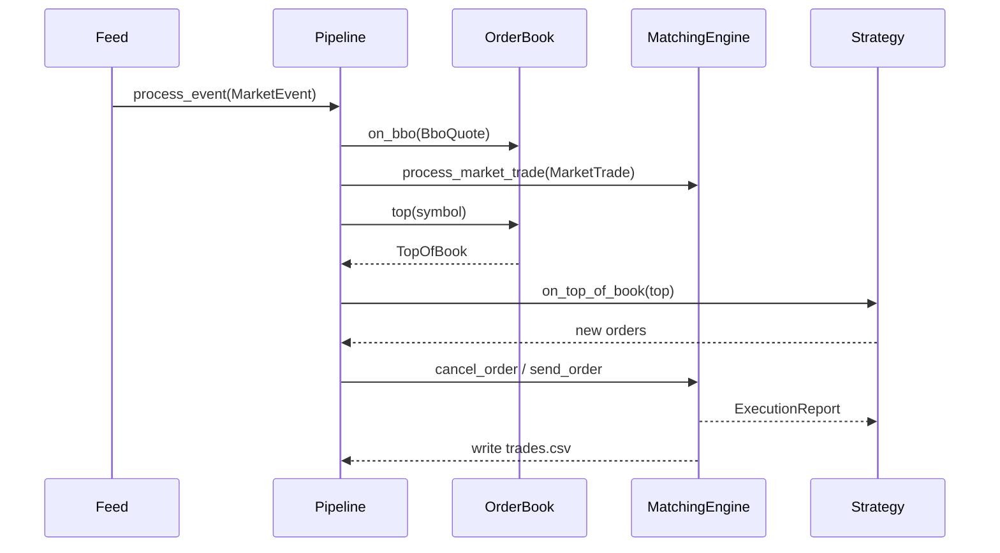
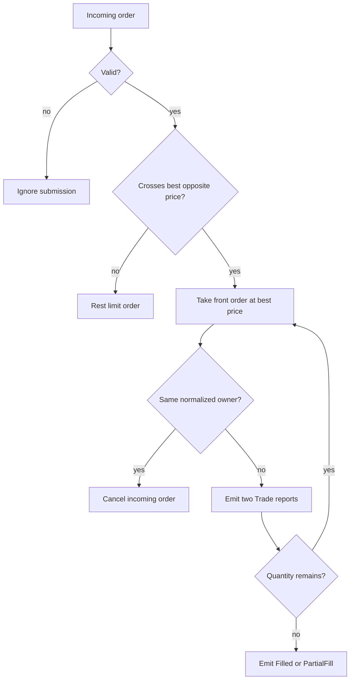
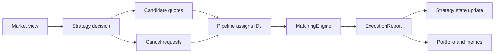
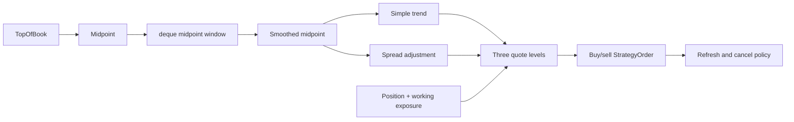
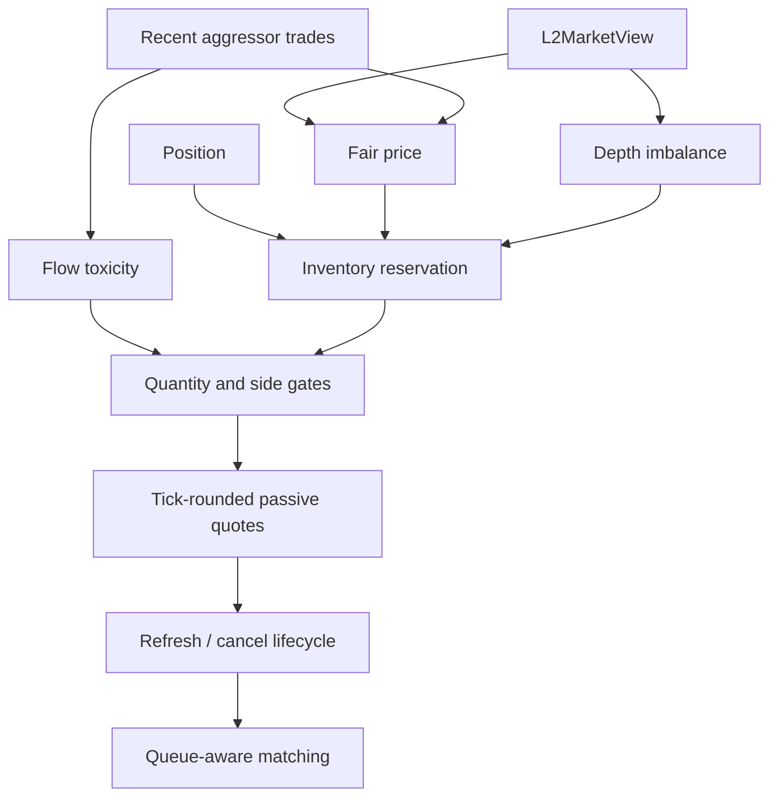

# Architecture

ToyQuant is a small event-driven market-making simulator. It connects market-data input, a simplified order book, strategy decisions, order matching, execution reports, and CSV output. This page explains the implementation by source file; [User Guide](USER_GUIDE.md) contains the commands, scenarios, and experiment workflow.

## How to read this document

| You want to understand... | Start here |
|---|---|
| End-to-end event flow | [System Map](#1-system-map) |
| Input formats and validation | [Shared Types and Input Boundary](#2-shared-types-and-input-boundary) |
| Object ownership and callbacks | [Application Coordinator](#3-application-coordinator) |
| External book versus strategy orders | [OrderBook](#4-orderbook-external-market-view) and [MatchingEngine](#5-matchingengine-orders-queues-and-reports) |
| How strategies make decisions | [Strategy](#6-strategy-the-main-decision-module) |
| PnL and reusable metrics | [Backtest and Performance Metrics](#7-backtest-and-performance-metrics) |

The diagrams show control flow. The tables show ownership and responsibilities. The code blocks
show the smallest representative implementation surface; detailed prose explains only the design
decisions that are not obvious from those views.

## 1. System Map



The v2 central path is intentionally short:

```text
MarketEvent -> OrderBook / MatchingEngine -> Strategy -> orders -> reports -> output
```



CSV and UDP remain compatibility inputs for the original Tick model. They enter through the
`legacy` boundary and are not the v2 market-data contract.

The source map is:

| Responsibility | Main files | Key types or functions |
|---|---|---|
| Shared data | `src/common/types.h`, `src/market/market_event.h` | `Side`, `ExecType`, `MarketEvent` |
| Instrument rules | `src/common/instrument_spec.h` | `InstrumentSpec`, `btc_usdt_spec` |
| Legacy input | `src/market/csv_feed.*`, `udp_feed.*`, `src/legacy/*` | `legacy::Tick`, `legacy::TickPipeline`, `legacy::tick_csv` |
| Market replay | `src/market/market_data_adapter.*`, `replay_feed.*` | `IMarketEventReader`, `ReplayFeed::run` |
| Coordination | `src/app/application.*`, `src/app/pipeline.*` | `Pipeline::process_event`, legacy adapter, output callbacks |
| Market view | `src/orderbook/orderbook.*`, `l2_orderbook.*` | `TopOfBook`, `OrderBook::market_top`, `L2OrderBook` |
| Matching | `src/exchange/matching_engine.*` | `MatchingEngine::match`, `send_order` |
| Strategy | `src/strategy/strategy.h`, `market_maker.h`, `l2_market_maker.h`, `active_l2_market_maker.h` | `Strategy`, L1 and L2 strategy families |
| Legacy analysis | `src/backtest/backtest_driver.*` | `legacy::BacktestDriver::run`, `print_report` |
| Runtime logging | `src/utils/logger.*` | `Logger::log`, `Logger::error` |

## 2. Shared Types and Input Boundary

**Files:** `src/market/market_event.h`, `src/legacy/tick.h`, `src/legacy/tick_csv_parser.*`, `src/market/csv_feed.*`, `src/market/udp_feed.*`

The legacy CSV and UDP feeds produce the original `Tick` contract:

```cpp
namespace legacy
{
struct Tick
{
    uint64_t ts = 0;
    std::string symbol;
    double price = 0.0;
    uint64_t size = 0;
    Side side = Side::Unknown;
};

using TickCallback = std::function<void(const Tick&)>;
}
```

The legacy CSV and UDP paths retain this contract. Trades+BBO replay and L2 snapshot input use a
richer boundary:

```cpp
using MarketEvent = std::variant<MarketTrade, BboQuote, MarketDepthSnapshot>;
```

`IMarketEventReader` isolates vendor schemas from replay. The Binance readers map aggregate trades
and book ticker rows into these domain events; `ReplayFeed` only performs streaming timestamp
merge. To support another vendor, implement readers for its files and add a factory branch in
`make_market_data_readers` without changing `Pipeline`, the strategy, or matching code.

Each v2 event carries an optional `exchange` identity. Binance L1 readers set it to `binance`,
while the Deribit L2 snapshot reader preserves the source column. `Pipeline` locks to the first
non-empty exchange and rejects later events from another exchange. This prevents Binance `BTCUSDT`
L1 parameters from being silently combined with Deribit `BTC-PERPETUAL` L2 data.

Before dispatch, `MarketDataValidator` rejects structural errors: non-positive or non-finite
prices, zero quantities, unknown trade sides, crossed BBO, timestamp regression, and non-increasing
per-stream sequence numbers. Cross-stream conditions are reported rather than rejected: trades
without a prior BBO, trades using a BBO older than one second, and trades more than 5 basis points
from the latest BBO midpoint. The replay `Pipeline` also filters trades without a usable BBO or beyond
the 5-basis-point deviation threshold before sending them to the strategy and matching engine,
preventing invalid alignment from creating synthetic fills.

`InstrumentSpec` is shared by the market-data adapter, strategy, order book, and matching engine.
Fee rates are carried in the specification and injected into the replay matching engine. The
current Deribit BTC perpetual benchmark assumes a 0.02% maker fee and 0.05% taker fee; these are
simulation assumptions, not account-tier guarantees.
For BTCUSDT it defines a `0.10` price tick and `1000000` integer quantity units per BTC. The replay
strategy therefore uses `0.001 BTC` base orders, a two-tick base spread, and a `0.1 BTC` inventory
limit.
Execution reports then carry the liquidity role and fee for each MarketMaker fill; the current
offline backtest can consume those recorded fees while retaining a fee-rate fallback for legacy
six-column trade files.

BBO events update the external top of book and trigger quoting. Trade events carry aggressor side
and drive matching. External Tick/BBO state is stored separately from local strategy orders.
`market_top()` exposes only venue prices through `IOrderBook`. Strategy orders are owned only by
`MatchingEngine`; there is intentionally no local or combined view in `OrderBook`, so strategy code
cannot accidentally include its own orders in the market reference.

`L2OrderBook` is a separate multi-level view for `MarketDepthSnapshot` events. It replaces the
snapshot atomically, validates ordering and sequence, and derives an `L2MarketView`. The L2 replay
path passes that view explicitly to the selected strategy after venue and instrument validation;
raw vendor rows never enter strategy code, and Binance L1 data is not combined with Deribit L2.

The incremental L2 path uses `IncrementalBookBatch` events. The reader groups rows sharing a
`local_timestamp`, skips buffered updates before the first snapshot, and preserves snapshot-batch
reset boundaries. Each update sets an absolute level amount; amount zero removes the level. After
the batch is applied, the same `L2MarketView` interface is emitted, so strategies do not depend on
whether the source was a reconstructed snapshot or an incremental feed.

The validator enforces monotonic exchange and local timestamps and counts snapshot/reset batches
as reconnect diagnostics. The current normalized CSV schema does not expose Deribit
`prev_change_id`, so a true exchange sequence-gap check is intentionally not claimed; a future
adapter can add that field without changing the strategy interface.

The matching engine also retains the latest BBO liquidity for aggressive strategy orders. A buy
limit at or above the best ask executes at the ask; a sell limit at or below the best bid executes
at the bid. Execution is capped by the displayed BBO quantity, which is consumed across subsequent
orders until the next BBO update. Any unfilled remainder enters the existing local limit-order book.

`CsvFeed::run` reads rows, converts them into `Tick`, and invokes `cb_(t)`. The parser lives under
`src/legacy`, and `legacy::TickPipeline` is the explicit compatibility boundary before the old
Tick processing path. Malformed rows are reported and skipped.

`UdpFeed` has a different transport but the same legacy output contract. On Linux, `recvmmsg` receives
datagrams in batches. The parser uses `std::string_view` and `find`, then publishes parsed ticks
through a fixed-size ring buffer:

```cpp
size_t h = head_.load(std::memory_order_relaxed);
size_t next = (h + 1) % RING_SIZE;

if (next != tail_.load(std::memory_order_acquire))
{
    ring_[h] = t;
    head_.store(next, std::memory_order_release);
}
```

The producer publishes the tick before release-storing `head_`; the consumer acquire-loads the
index before reading the slot. This is a single-producer/single-consumer atomic queue. A full ring
drops the incoming tick by design.

## 3. Application Coordinator

**Files:** `src/app/application.*`, `src/app/pipeline.*`

`main.cpp` is only the process bootstrap. `Application` wires concrete objects together. The
`LegacyCsv` and `LegacyUdp` modes create a legacy Tick adapter, `Replay` creates a Trades+BBO
event feed, and `L2Replay` creates a trade+depth feed. `Pipeline` owns the v2 domain sequence; the
application intentionally does not introduce separate runner abstractions yet.



The report callback is the other important application boundary:

```cpp
engine_.set_report_callback(
    [this](const ExecutionReport& report)
    {
        strategy_.on_order_update(report);
        write_trade_csv_row(trades_out_, report);
    });
```

The `[this]` lambda is a C++11 closure. `Pipeline` stores references to its collaborators rather than owning them; the run function constructs them in an enclosing scope and destroys them after the feed finishes. `std::unique_ptr<Strategy>` expresses exclusive ownership of the selected concrete strategy, while `std::atomic<uint64_t>` supplies the order-ID counter.

`orders.csv` is written when the pipeline submits a candidate order, before the matching result is known. `trades.csv` receives only `Trade` reports owned by `MarketMaker`; `Resting`, `Filled`, and `Cancelled` are lifecycle events, not additional executions. New trade files append `liquidity_role` and `fee` columns; the six required legacy columns remain unchanged for compatibility.

### 3.1 Dependency injection at the coordinator boundary

`Pipeline` does not construct the order book, strategy, matching engine, or output streams itself. They are created by the application mode and passed into the constructor:

```cpp
auto output_files = open_output_files(source);
OrderBook order_book;
auto strategy = make_strategy(cfg.strategy_name);
Logger logger(to_abs_path("logs/toy_quant.log"));
MatchingEngine engine(&logger);
Pipeline pipeline(output_files.orders, output_files.trades, order_book, *strategy, engine, logger);
```

The constructor receives the domain collaborators through their interfaces and stores references to them:

```cpp
Pipeline(std::ofstream& orders_out, std::ofstream& trades_out, IOrderBook& order_book,
                 Strategy& strategy, IMatchingEngine& engine, Logger& logger)
    : orders_out_(orders_out),
      trades_out_(trades_out),
      order_book_(order_book),
      strategy_(strategy),
            engine_(engine),
            logger_(logger)
{
    // Install the report boundary after the collaborators are available.
}
```

This is constructor injection: the `Pipeline` declares what it needs, while the caller chooses the concrete implementations. `IOrderBook` and `IMatchingEngine` make the coordinator depend on behavior rather than on `OrderBook` and `MatchingEngine` details. The strategy is injected through the `Strategy` base class, so the same pipeline can run `NaiveMarketMaker`, `OptimizedMarketMaker`, or `L1MarketMaker`:

```cpp
std::unique_ptr<Strategy> make_strategy(const std::string& strategy_name)
{
    if (strategy_name == "naive")
    {
        return std::make_unique<NaiveMarketMaker>(100, 0.00001);
    }
    if (strategy_name == "l1")
    {
        L1MarketMakerConfig config;
        config.order_size = 100;
        config.base_spread = 0.000003;
        return std::make_unique<L1MarketMaker>(config);
    }
    return std::make_unique<OptimizedMarketMaker>(100, 0.000003);
}
```

Dependency injection keeps construction at the application boundary and the event sequence in
`Pipeline`. Interfaces and callbacks also give focused tests substitution points without requiring
the complete application.

### 3.2 RAII and lifetime-bound resources

The application uses RAII, or Resource Acquisition Is Initialization, to bind cleanup to object lifetime. In the legacy CSV mode, the local objects are created in dependency order and remain alive while the feed invokes the pipeline:

```cpp
auto output_files = open_output_files(source);
OrderBook order_book;
auto strategy = make_strategy(cfg.strategy_name);
Logger logger(to_abs_path("logs/toy_quant.log"));
MatchingEngine engine(&logger);
Pipeline pipeline(output_files.orders, output_files.trades, order_book, *strategy, engine, logger);
legacy::TickPipeline tick_pipeline(pipeline, order_book, order_book, engine);
CsvFeed feed(csv_file, [&](const legacy::Tick& tick) { tick_pipeline.process(tick, true); }, cfg.delay,
             &logger);
feed.run();
```

When `run_legacy_csv_mode` returns, destruction runs in reverse declaration order. The feed, pipeline,
logger, strategy, order book, and output streams clean themselves up through object lifetime. The
same cleanup occurs during stack unwinding if the feed throws.

The locking code applies the same rule to synchronization:

```cpp
TopOfBook OrderBook::market_top(const std::string& symbol)
{
    std::lock_guard<std::mutex> lock(mtx_);
    // Read the protected book state and return a snapshot.
}
```

Constructing `lock` acquires `mtx_`; leaving the function releases it automatically. The same RAII
pattern protects order-book updates, while `std::unique_ptr<Strategy>` owns the selected strategy.

### 3.3 Unified runtime logging

**Files:** `src/utils/logger.h`, `src/utils/logger.cpp`

`Logger` owns the optional text log file and mirrors each message to the appropriate console stream. `log(...)` writes to `stdout`; `error(...)` writes to `stderr`. When an application supplies a file path, the constructor creates its parent directory, opens the file in truncate mode for the current run, and `write` copies every message to that file. An empty path preserves console output without opening a file.

The application entry points own the `Logger`: CSV and UDP runs use `logs/toy_quant.log`, while `backtest_main` uses its configurable backtest log path. They pass it to the components that emit runtime events. `Pipeline` and `BacktestDriver` require `Logger&`, because their lifetime is always within the entry point's logging scope. `CsvFeed` and `MatchingEngine` accept an optional `Logger*`, preserving standalone construction for narrow tests and other callers:

```cpp
Logger logger(to_abs_path("logs/toy_quant.log"));
MatchingEngine engine(&logger);
CsvFeed feed(path, callback, delay, &logger);
```

This is dependency injection rather than a global logger. Market data, matching, and backtesting describe events but do not decide file locations, create directories, or manage file streams. `orders.csv` and `trades.csv` remain separate: they are structured business records consumed by the backtest, not human-readable runtime logs.

`Logger` uses a variadic template so callers can stream several values without manually constructing a temporary string:

```cpp
template <typename... Args>
void log(Args&&... args)
{
    write(format(std::forward<Args>(args)...), std::cout);
}
```

`typename... Args` declares a template parameter pack: at each call, the compiler deduces zero or more argument types. For example, `logger.log("order=", id, " qty=", quantity)` deduces types for the string literals and numeric values. `Args&&...` is a forwarding-reference parameter pack, and `std::forward<Args>(args)...` preserves whether each argument was an lvalue or rvalue when passing it to `format`.

Inside `format`, the fold expression `(stream << ... << args)` expands the pack into chained stream insertions. The example above is conceptually `stream << "order=" << id << " qty=" << quantity`. The resulting `std::string` lets the non-template `write` method implement the destination policy only once. The template definitions remain in the header because the compiler must see their bodies when it instantiates them for each argument combination.

## 4. OrderBook: External Market View

**Files:** `src/orderbook/orderbook.h`, `src/orderbook/orderbook.cpp`

`OrderBook` contains external market data only. Legacy Tick input updates simplified bid or ask
price maps, while Trades+BBO replay replaces the latest venue BBO snapshot.

```cpp
struct SideBook
{
    std::map<PriceTick, uint64_t, std::greater<PriceTick>> external_bids_qty;
    std::map<PriceTick, uint64_t> external_asks_qty;
    BboQuote external_bbo;
    bool has_external_bbo{false};
};
```

For legacy input, the comparators make the first bid the highest price and the first ask the lowest.
For v2 replay, `market_top()` directly returns the latest valid `external_bbo`. The mutex protects
market updates and snapshots. Local strategy orders do not enter this object.

### 4.1 Single ownership of strategy orders

`MatchingEngine` is the single source of truth for working strategy orders:

```cpp
std::unordered_map<std::string, MEOrderBook> books_;
std::unordered_map<uint64_t, exchange::Order*> order_index_;
```

Each price level owns FIFO orders in a `std::list`, so pointers in `order_index_` remain stable until
that order is erased. Submission, partial fills, fills, and cancellation mutate this one structure;
execution reports notify the strategy of lifecycle changes. The former mirrored private
`OrderBook` state was removed to eliminate synchronization drift.

### 4.2 Price representation

External inputs, strategy calculations, CSV records, and reports use `double` for readability.
Before a price is used as an order-book key or in matching comparisons, the implementation converts
it to an integer tick:

```cpp
using PriceTick = int64_t;
std::map<PriceTick, uint64_t, std::greater<PriceTick>> bids_qty;
```

```cpp
inline PriceTick to_price_tick(double price)
{
    return static_cast<PriceTick>(std::llround(price / PRICE_TICK_SIZE));
}
```

The matching engine uses the same `PriceTick` keys for price-time priority and cancellation.
`to_price()` converts ticks back to `double` only at output boundaries. Integer ticks make level
identity, comparison, and ordering deterministic while retaining readable public records.

## 5. MatchingEngine: Orders, Queues, and Reports

**Files:** `src/exchange/order.h`, `execution_report.h`, `matching_engine.*`

The exchange namespace defines the order vocabulary. `Order` carries identity, symbol, side, limit or market type, original quantity, remaining quantity, timestamp, and owner. `ExecutionReport` adds the event type and reports either a fill or a lifecycle transition.

```cpp
struct ExecutionReport
{
    uint64_t order_id{};
    exchange::Side side{};
    ExecType exec_type{};
    std::string symbol;
    double price{};
    uint64_t quantity{};
    uint64_t ts{};
    std::string owner;
};
```

The main matching rules are:

- External ticks become `Market` orders, so they consume strategy liquidity but are never rested.
- Each price level uses FIFO order and matches the best executable price first.
- Owner normalization prevents `MarketMaker` from trading with itself.
- In L2 replay, a maker order submitted at the displayed best price joins behind the displayed
    top-level quantity. Subsequent market trades consume this `external_queue_ahead` before local
    FIFO orders become eligible to fill. Ordinary L1 replay keeps its existing BBO semantics.

The matching algorithm is a direct price-time implementation:

```cpp
auto best_ask_it = book.asks.begin();
double best_price = best_ask_it->first;
if (new_order.price < best_price) break;

Order& resting = ask_queue.front();
uint64_t traded = std::min(qty, resting.remaining);
qty -= traded;
resting.remaining -= traded;
```

The engine emits `Trade` reports for executions, then `PartialFill` or `Filled` for the resting
order. An unfilled incoming limit order receives `Resting` and enters the appropriate queue.



Owner normalization removes whitespace and lowercases characters. A self-trade cancels the
aggressor. `Trade.quantity` is executed quantity; lifecycle quantities are remaining quantity.

## 6. Strategy: The Main Decision Module

**Files:** `src/strategy/strategy.h`, `src/strategy/market_maker.h`

The strategy is the decision layer, not the matching layer. It sees `TopOfBook`, keeps its own working-order and position state, and returns candidate `StrategyOrder` values. The pipeline later assigns IDs and converts them to `exchange::Order`.

```cpp
class Strategy
{
   public:
    virtual ~Strategy() = default;
    virtual std::vector<StrategyOrder> on_top_of_book(
        const std::string& symbol, const TopOfBook& tob) = 0;
    virtual void on_order_submitted(const StrategyOrder& order) = 0;
    virtual std::vector<uint64_t> cancel_requests() = 0;
    virtual int64_t net_position() const = 0;
    virtual size_t working_order_count() const = 0;
    virtual void on_order_update(const ExecutionReport& report) = 0;
};
```

`main.cpp` selects an implementation with `std::make_unique`; the pipeline then uses the common
interface without knowing which strategy is active. The virtual destructor makes polymorphic
ownership safe.

### Strategy lifecycle at a glance



| Callback | Direction | Responsibility |
|---|---|---|
| `on_top_of_book` / `on_l2_market_view` | Pipeline -> strategy | Produce the next candidate quote set |
| `on_market_trade` | Pipeline -> strategy | Update aggressor-flow state |
| `on_order_submitted` | Pipeline -> strategy | Record exchange-assigned working orders |
| `cancel_requests` | Strategy -> pipeline | Return stale or unsafe order IDs |
| `on_order_update` | MatchingEngine -> strategy | Apply fills, cancellations, and partial fills |

The strategy chooses intent. The pipeline owns sequencing and IDs. The matching engine owns actual
working orders. This separation is the key invariant for every strategy family below.

### Strategy family map

| Family | Input view | Main purpose | Execution model |
|---|---|---|---|
| Legacy | `Tick` | Compatibility and simple demonstrations | Legacy tick pipeline |
| L1 replay | `TopOfBook` + trades | BBO-aware quoting | Trades+BBO matching |
| L2 replay | `L2MarketView` + trades | Depth-aware quoting and queue diagnostics | Queue-aware L2 matching |

### 6.1 NaiveMarketMaker: baseline quote

The naive strategy requires both sides of the top of book, computes the midpoint, places one quote on each side, and rounds both prices to the configured tick size:

```cpp
double mid = (tob.bid_price + tob.ask_price) / 2.0;
double buy_price = std::round((mid - base_spread / 2.0) / tick_size) * tick_size;
double sell_price = std::round((mid + base_spread / 2.0) / tick_size) * tick_size;

orders.push_back(StrategyOrder(Side::Buy, symbol, buy_price, base_order_size, 0));
orders.push_back(StrategyOrder(Side::Sell, symbol, sell_price, base_order_size, 0));
```

It does not request cancellations, so working orders can accumulate. It updates position from
`Trade` reports and serves as a deliberately simple baseline.

### 6.2 OptimizedMarketMaker: stateful quoting

The optimized strategy adds controls in a deliberate order:



`OptimizedMarketMaker` is the stateful strategy. It keeps a window of recent midpoints in a
`std::deque`, averages that window, and estimates short-term trend from the change in the smoothed
midpoint. It then builds up to three quote levels. The core price adjustment is:

```cpp
double raw_buy = smooth_mid - level_spread / 2.0 - std::max(0.0, trend) -
                 inv_spread_bias * (inventory > 0 ? 1.0 : 0.0);
double raw_sell = smooth_mid + level_spread / 2.0 + std::max(0.0, trend) +
                  inv_spread_bias * (inventory < 0 ? 1.0 : 0.0);

double buy_price = std::round(raw_buy / tick_size) * tick_size;
double sell_price = std::round(raw_sell / tick_size) * tick_size;
```

Inventory is `position + working_exposure`, with buys positive and sells negative. If inventory is
long, the strategy makes buys less attractive and reduces buy size, encouraging future sells. If
inventory is short, it applies the symmetric adjustment to sells. Once the limit is exceeded, the
risky side is disabled.

The refresh policy separates “should quote now?” from “which old orders must be cancelled?”:

- `quote_age_ticks` forces refresh after an age limit.
- `quote_refresh_ticks` compares the smoothed midpoint with `last_quote_mid`.
- `cancel_requests()` returns active IDs when a quote is stale.
- `on_order_submitted()` records IDs and resets quote age.

In short: observations create quotes, submitted IDs become working state, execution reports update
quantities and position, and stale quotes are cancelled before replacement.

### 6.3 L1MarketMaker: BBO-aware quoting

`L1MarketMaker` is the replay-oriented single-level strategy. It consumes BBO updates for quoting
and venue trades for order-flow information. Its behavior is intentionally layered so each risk
control has a distinct purpose:

1. **Input filtering.** A trade is used for imbalance only when a latest BBO exists, the trade is
    not older than the BBO, its BBO age is below `max_market_trade_age`, and its price deviation
    from the BBO midpoint is below `max_trade_deviation_bps`. Direct one-argument calls remain
    available for focused tests; the replay pipeline uses the BBO-aware overload.
2. **Flow and volatility state.** A single FIFO window of `TradeSample` values tracks buy and sell
    aggressor volume. A rolling window of absolute midpoint changes estimates short-term movement.
    This is a simple educational volatility proxy, not a statistical volatility model.
3. **Reservation price.** Effective inventory is `position + working_exposure`, where working buys
    are positive and working sells are negative. The reservation midpoint is shifted by a bounded
    `tanh(inventory / inventory_limit)` term: long inventory shifts the center down to discourage
    more buying, while short inventory shifts it up to encourage buying back.
4. **Quote width.** The effective spread is at least the larger of the configured base spread and
    current market spread, plus twice the average midpoint change. Trade-flow and BBO-size imbalance
    add an adverse shift to both sides. Prices are rounded to the instrument tick and clipped to
    remain passive relative to the venue BBO.
5. **Quote size.** Volatility stress reduces both sides toward a configurable minimum quantity
    ratio. Inventory reduces only the risky side. Above `inventory_risk_threshold`, the risky side is
    disabled and only the inventory-reducing side remains.
6. **Lifecycle and measurement.** A changed quote first requests cancellation; replacement waits for
    cancellation reports. The strategy tracks quote-cycle lifetime, delayed markout, adverse
    selection, inventory path statistics, fills, cancels, and submitted quantity.

The tunable values are grouped in `L1MarketMakerConfig`. The legacy positional constructor remains
for compatibility, while the application entry point uses the named configuration object. The
configuration is deliberately in-process rather than JSON/YAML: this project is an educational
simulator, not a production configuration service.

`StrategyMetrics` exposes the L1 measurements through the common strategy interface. The runtime
summary can therefore report L1-specific observations without downcasting the strategy. These
metrics are execution diagnostics: `captured_edge` is an immediate midpoint comparison, while
`adverse_selection` is a later markout after `markout_horizon_quotes` BBO cycles. Neither includes
fees or constitutes a complete portfolio PnL calculation.

### 6.4 ActiveL2MarketMaker: L2 mainline

The L2 strategy receives an explicit `L2MarketView` from `L2OrderBook`. The view contains the
top of book, micro-price, aggregated depth, depth imbalance, symbol, and snapshot timestamp. L2
strategy state is separate from the L1 `OrderBook`; it never consumes raw vendor rows.



| Production setting | Value | Used for |
|---|---:|---|
| Signal mode | `Flow` | Combines micro-price, depth, and trades |
| Trade window | `16` events | Recent aggressor-flow estimate |
| Imbalance shift | `2 * tick_size` | Depth contribution to fair price |
| Trade shift | `1 * tick_size` | Flow contribution to fair price |
| Refresh threshold | `2` ticks | Repricing trigger |
| Maximum quote age | `50` L2 decisions | Stale-quote fallback |
| Toxicity threshold | `0.65` | Disables the threatened side |
| Weak-flow threshold | `0.9` | Activates extreme-flow protection |
| Volatility alpha | `0.25` | Active-L2 EWMA smoothing |
| Pause threshold | `9` ticks/second | Extreme-volatility risk gate |

#### 6.4.1 Fair-price construction

`L2MarketMaker` supports `Baseline`, `Depth`, `Micro`, and `Flow` signal modes. The production
factory selects `Flow` with a 16-trade FIFO window. In that mode the fair price is:

```text
fair = micro_price
    + depth_imbalance * imbalance_shift
    + trade_imbalance * trade_imbalance_shift
```

`depth_imbalance` is the normalized bid-versus-ask quantity across the configured visible levels.
`trade_imbalance` is the normalized aggressor buy-versus-sell volume in the recent trade window.
The micro-price uses top-level quantities to move the reference toward the side with less displayed
liquidity. These signals shift the reservation price; they do not authorize crossing the spread.

#### 6.4.2 Inventory and toxicity controls

The base engine computes:

```text
inventory_ratio = clamp(position / inventory_limit, -1, 1)
inventory_shift = inventory_ratio * base_spread
```

Long inventory moves the reservation price down and makes additional buys less attractive; short
inventory applies the symmetric behavior. At the hard inventory limit, the risk-increasing side is
disabled.

For flow toxicity, the configured threshold is `0.65`. A strongly positive flow disables the sell
side; a strongly negative flow disables the buy side. When flow magnitude exceeds `0.9` while
inventory is already materially imbalanced, weak-flow protection halves both quote quantities and
moves both prices one tick farther from the center. The name `weak_flow` refers to weakening the
quotes, not to weak market flow.

#### 6.4.3 Passive quote construction and lifecycle

Prices are tick-rounded around the fair price, inventory shift, and weak-flow shift. A final passive
clip enforces:

```text
bid <= external_best_bid
ask >= external_best_ask
```

This keeps the L2 strategies maker-only. When orders are working, a fair-price move of two ticks
requests cancellation. The active mainline counts quote age only when the external top-of-book
midpoint moves by at least one tick; depth-only updates do not consume quote lifetime. This avoids
treating incremental feed granularity as market movement. The fallback maximum age remains 50
market-price decisions. The pipeline processes cancellation before allowing replacement, and the
active strategy records price refreshes, age refreshes, and risk pauses separately.

This behavior is specifically important for incremental input: many updates change displayed
quantity without moving the best price. Counting every such update as quote age creates artificial
refresh churn. The retained rule removes that data-resolution artifact without changing the fair
price, inventory, toxicity, or passive-price logic.

The pipeline also reports consumed queue volume back to the strategy. If a quote reaches its age
limit while the queue ahead is actively being consumed and fair price has not changed, L2 retains
the quote and resets its age instead of cancelling and losing time priority. A price change or risk
pause still takes precedence. The preservation is bounded to three holds before a stale quote must
be reconsidered. This is a queue-preservation rule, not a profitability assumption.

#### 6.4.4 Active risk overlay

`ActiveL2MarketMaker` composes `L2MarketMaker`; it does not duplicate its inventory or flow logic.
It maintains a time-normalized midpoint-movement EWMA:

```text
volatility = alpha * normalized_move + (1 - alpha) * previous_volatility
```

The production value is `alpha = 0.25`. Ordinary volatility does not widen quotes. When the EWMA
reaches `9` ticks per second, active L2 requests cancellation of all working orders and pauses new
submissions. This is a tail-risk gate, not a continuous spread signal. The historical
`adaptive_l2` name is accepted only at the factory boundary and constructs this same class.

For both snapshot and incremental batches, the EWMA uses exchange event time so strategy signals are
normalized against market time rather than file or network processing cadence. Incremental
`local_ts` remains available in `L2MarketView` for future latency diagnostics, but does not alter
the current trading decision. The same market period can still produce different quote-cycle counts
because incremental data contains more update batches; that execution-resolution difference must be
measured before comparing PnL.

#### 6.4.5 Execution and queue model

Before L2 strategy decisions, `Pipeline::process_l2_market_view` sends the snapshot top of book to
`MatchingEngine::process_l2_top`. If a maker order joins the displayed best price, the displayed
quantity is stored as `external_queue_ahead`. Subsequent market trades consume that quantity before
the local FIFO order. This prevents a new order from receiving queue-first fills.

The engine exposes `queue_ahead_consumed` in the run summary. Queue-clear diagnostics count price
levels whose external queue reaches zero; they do not measure cleared quantity. Fees are calculated at execution time
from `InstrumentSpec`; the current Deribit BTC perpetual benchmark assumes maker `0.02%` and taker
`0.05%`. The L2 replay is therefore evaluated on net PnL, fees, maker/taker role, queue consumption,
markout, inventory, and refresh-cause metrics together.

The matching engine supports three queue interpretations. `Conservative` (the default) advances
the local queue only when a public trade matches the price; an aggregated displayed-quantity
reduction is treated as ambiguous and does not create a fill. `Heuristic` advances a configurable
fraction of such reductions, while `Optimistic` advances the full reduction. The latter two are
sensitivity models, not claims about order-level truth. Run summaries report trade-driven queue
consumption, quantity-change-driven consumption, and queue-clear counts separately so L2 results
can be compared as a bounded execution range rather than as one unexplained fill rate.

The C++ replay path supports both source types. The Python benchmark reconstructs a compact top-five
timeline from grouped incremental updates so execution and markout fields use the same report shape
for both sources. This is a top-five comparison timeline, not an order-level queue reconstruction.

The current active L2 implementation is intentionally a conservative research mainline. Its
18-window in-sample baseline and four-window 2020-05-01 sample-out-of-time check remain negative
after fees. The strategy is structurally complete for this simulator, but those results do not
establish live profitability.

Every L2 replay records its queue model. `conservative` is the mainline result: only public
trades advance the queue. `heuristic` and `optimistic` are sensitivity bounds for information
lost by aggregated L2 data, not proof of live fill probability. A strategy comparison is useful
only when its behavior remains reasonable across multiple windows, dates, and queue models.

The L2 replay applies a fixed one-market-event cancellation delay. Legacy CSV/UDP and ordinary
snapshot replay use the configured delay path; this delay is event-count based, not milliseconds.
The run summary also records `audited_orders`, `audited_filled_orders`,
`audited_cancelled_orders`, `cancelled_after_fill_orders`, `cancelled_before_fill_orders`, and
`total_order_lifetime_cycles`. The last field counts quote decision cycles, not elapsed time.

### 6.5 Strategy families and comparison

For the same `sample_ticks.csv` run, the two legacy Tick strategies diverge immediately:

| Strategy | Submitted orders | Submitted quantity | Cancel requests | Fill rate | Net position | Current equity | Max drawdown |
|---|---:|---:|---:|---:|---:|---:|---:|
| `naive` | 38 | 3800 | 0 | 0.231579 | -880 | 999.286800 | 0.000717 |
| `optimized` | 24 | 1379 | 9 | 0.31037 | -428 | 999.670190 | 0.000334 |

The table uses an initial capital of `1000.0`. It shows the core difference: `naive` is more aggressive and leaves more working orders behind, while `optimized` submits less, cancels stale quotes, and ends with smaller adverse position and drawdown. That is why the optimized version is the better demonstration of stateful market making in this project.

`L1MarketMaker` is evaluated on the Trades+BBO replay path rather than this legacy Tick-only
comparison. Its additional runtime measurements are useful for explaining quote safety and
execution quality, but they are not yet folded into the offline PnL report.

The Trades+BBO replay path has an L1 strategy family. These variants share the same `Strategy` interface,
instrument scale, matching engine, and fee model, so the comparison isolates decision behavior:

| Strategy | Main idea | Strength | Limitation | Role in this demo |
|---|---|---|---|---|
| `passive_l1` | Fixed two-sided L1 quotes with basic inventory limits | Simple and easy to explain | Does not use trade flow or volatility | Passive baseline |
| `inventory_aware_l1` | Inventory-dependent price and quantity skew | Demonstrates risk-aware quoting | Can still trade too much in a one-sided market | Inventory baseline |
| `flow_aware_l1` | Adds recent aggressor-flow and BBO-size imbalance | Avoids some flow-against trades | Still a transitional experiment; may reduce activity too much | Flow experiment |
| `active_l1` | Inventory-reversion-first quotes with shorter quote lifetime | More visible activity and inventory rotation | More adverse-selection and inventory risk | Active experiment |
| `l1` | Combines inventory, volatility, flow, markout, refresh, and fee-aware spread controls | Most complete replay strategy | More mechanisms and metrics to interpret | Mainline demo strategy |

`PassiveL1MarketMaker` refreshes quotes when the midpoint, BBO, or quote age changes, but its
prices remain symmetric around the midpoint. Its inventory logic limits the risky side without
using a forecast of short-term direction.

`InventoryAwareL1MarketMaker` shifts the two quote offsets according to the signed inventory and
reduces the risky-side quantity. It is useful for showing the difference between a neutral maker
and one that actively controls exposure, but it does not retain a trade-flow window.

`FlowAwareL1MarketMaker` keeps a quantity-weighted FIFO window of recent aggressor trades. It
combines trade imbalance and displayed BBO imbalance using the current demo weights `0.6` and
`0.4`. When the signal is sufficiently directional, it moves the threatened quote one tick away
and reduces the threatened-side quantity. It is intentionally bounded: it is a learning strategy,
not a claim of production alpha.

The mainline `L1MarketMaker` retains the more mature inventory and volatility controls, then adds
the useful flow-aware behavior as a constrained overlay. It also applies a fee-aware spread floor:
the configured base spread is compared with a fraction of the theoretical two-sided maker-fee
break-even spread. The current demo uses a `0.40` coverage factor, so the strategy does not treat
the result as a production profitability guarantee. The factor is a demonstration control that
helps make the relationship between gross PnL, fees, and net PnL visible.

`ActiveL1MarketMaker` is deliberately separate from `L1MarketMaker`. It gives inventory reduction
priority: when long, it moves the bid farther away and keeps the sell quote comparatively active;
when short, it does the opposite. It also expires quotes sooner and uses a simpler fee-aware
spread. This makes inventory rotation and trade activity easier to observe, but it accepts more
adverse-selection risk. It is an experiment for studying the activity-versus-execution-quality
trade-off, not a replacement for the defensive mainline. A fill immediately marks the quote as
stale, so the next BBO cycle can cancel and rebuild around the updated inventory. Its benchmark
metrics include submitted and filled quantity, quote count, captured edge, fees, average and peak
inventory, inventory sign changes, and quote lifetime.

The L2 replay family uses the separate `L2MarketView` contract described in section 6.4:

| Strategy | Main idea | Role |
|---|---|---|
| `passive_l2` | Baseline depth-aware quoting | Reference baseline |
| `inventory_aware_l2` | Adds an outer inventory adjustment layer | Inventory experiment |
| `flow_aware_l2` | Flow/depth fair-price behavior | Signal comparison |
| `active_l2` | Flow L2 engine plus volatility risk gate | L2 mainline |
| `adaptive_l2` | Compatibility name for `active_l2` | Legacy alias |

Unlike the L1 family, L2 decisions receive depth snapshots and use the queue-aware matching path.
L2 comparisons therefore include `queue_ahead_consumed`, maker/taker role, side-specific markout,
and refresh-cause metrics in addition to PnL and inventory. The detailed L2 decision sequence and
execution boundary remain in section 6.4; this subsection only defines comparison roles.

For the current BTCUSDT replay demo, the benchmark prints `gross_pnl`, `net_pnl`, `fees`,
`fee_ratio`, filtered market trades, filled quantity, final position, captured edge, adverse
selection, inventory path, markout counts, and quote lifetime. These execution-quality metrics are
computed by `Pipeline`, so simple and complex strategies share the same measurement basis. Always read gross PnL and fees together: a strategy can have
more fills or a positive captured edge while still losing after fees.

The benchmark can be run with:

```bash
./out/build/linux-debug/strategy_benchmark \
    data/v2/test_aggTrades_5k.csv \
    data/v2/test_bookTicker_5k.csv BTCUSDT 1000000
```

The benchmark is an educational replay, not a live-trading validation. Its results depend on the
selected replay window, displayed BBO liquidity, fee assumptions, and the quality of the paired
Trades+BBO data.

## 7. Backtest and Performance Metrics

**Files:** `src/backtest/backtest_driver.h`, `backtest_driver.cpp`

`BacktestDriver` is an offline analysis component. It reads the Tick file and recorded trades,
replays positions with slippage, and writes a report. It does not participate in live matching.

```cpp
double exec_price = trade.price +
    (trade.side == Side::Buy ? slippage_ : -slippage_);
double fee = trade.quantity * exec_price * fee_rate_;

auto& pos = positions[trade.symbol];
```

The PnL logic uses a **net-position** model: positive quantity is long, negative quantity is short,
and zero is flat. A buy first closes a short; a sell first closes a long; any remainder extends the
opposite position.

`Position` stores the average entry price. Closing quantity contributes to `realized_pnl`; remaining
quantity contributes unrealized PnL at the latest Tick price. The backtest uses an initial capital
baseline, records equity while replaying ticks and trades in timestamp order, and then computes
`max_drawdown` from that equity curve. The `orders_file` argument is retained for CLI compatibility
but is not read.

**Files:** `src/backtest/performance.*`, `tests/performance_test.cpp`

The reusable `metrics` module keeps formulas independent from the live pipeline and `BacktestDriver`.
The live pipeline uses execution metrics; the backtest uses maximum drawdown.

| Metric | Meaning | Current consumer |
|---|---|---|
| `fill_rate` | Filled quantity divided by submitted quantity | `Pipeline` execution summary |
| `cancel_rate` | Cancel requests divided by submitted orders | `Pipeline` execution summary |
| `inventory_exposure` | Absolute value of net position | `RunSummary` portfolio metrics |
| `max_drawdown` | Largest decline from an equity peak | `BacktestDriver` |
| `fees_paid` | Fees charged on recorded MarketMaker fills | Runtime and offline summaries |
| `adverse_selection` | Delayed fill markout accumulated after a quote horizon | L1 runtime summary |
| `average_abs_inventory` | Average absolute effective inventory at quote decisions | L1 runtime summary |
| `quote_lifetime` | Number of BBO decision cycles before fill or cancel | L1 runtime summary |
| `queue_ahead_consumed` | L2 market volume absorbed ahead of local maker orders | L2 runtime and benchmark summary |
| `buy_queue_ahead_levels_cleared`, `sell_queue_ahead_levels_cleared` | Number of price levels whose external queue reached zero | L2 runtime and benchmark summary |
| `audited_orders`, `audited_filled_orders`, `audited_cancelled_orders` | Order lifecycle terminal-state counts | Runtime summary |
| `cancelled_after_fill_orders`, `cancelled_before_fill_orders` | Cancelled orders split by whether they had a fill | Runtime summary |
| `total_order_lifetime_cycles` | Sum of quote-cycle lifetimes for audited orders | Runtime summary |

The metric tests cover zero denominators, positive and negative inventory, empty equity curves, and a known peak-to-trough drawdown. This separation lets future metrics be added without expanding `backtest_driver.h` or duplicating formulas in `main.cpp`.

