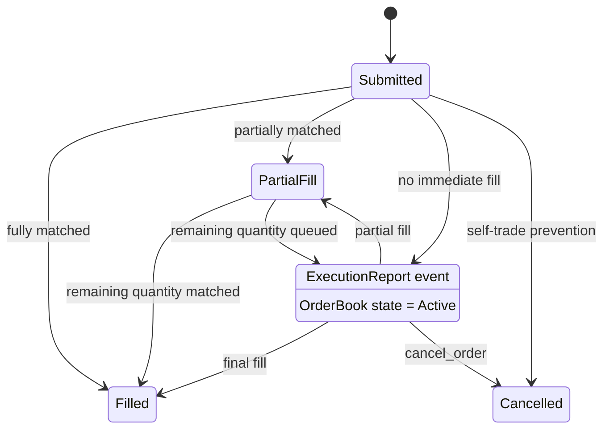

# ToyQuant User Guide

## Who This Is For

This guide assumes you can read basic C++ and understand ideas such as a bid, ask, trade, and position. It introduces how those ideas are connected inside a small quantitative trading system.

The goal is not to imitate a production exchange. It is to make one complete, reproducible path visible:

```text
Market data -> top of book -> strategy -> orders -> matching -> execution reports -> CSV output -> backtest
```

Read each module using the same pattern: **trading role**, **code**, and **C++ idea**. This is not a production trading platform and must not be used for live trading or investment decisions.

## What the Demo Does

The current implementation can:

- Replay market ticks from CSV.
- Receive ticks through a local UDP socket.
- Maintain a simplified top of book and local order state.
- Run either a naive or inventory-aware market-making strategy.
- Match local limit orders against synthetic external liquidity.
- Emit trade and lifecycle reports.
- Write orders and trades to CSV.
- Replay ticks and trades to calculate a basic PnL report.
- Run focused regression tests with CTest.

The implementation intentionally does not model full exchange behavior. It has no authentication, live exchange connectivity, FIX protocol, complete market depth, queue position, persistent recovery, risk gateway, or latency model.

## Repository Map

```text
src/
  main.cpp                Application entry point and pipeline wiring.
  market/                 CSV and UDP market-data feeds.
  orderbook/              Local order state and top-of-book calculation.
  strategy/               Strategy interface and market-making implementations.
  exchange/               Orders, reports, and matching engine.
  backtest/               PnL replay executable and metrics.
tests/                    Regression tests.
data/scenarios/           Input market-data scenarios.
data/runtime/             Generated orders and trades.
tools/                    Scenario generator and UDP sender.
docs/                     Architecture, scenarios, and this guide.
```

Useful companion documents:

- [Architecture](ARCHITECTURE.md)
- [Market Scenarios](SCENARIOS.md)
- [Data Files](../data/README.md)

## Build and Test

### Requirements

- CMake 3.16 or newer.
- A compiler with C++20 support.
- Python 3 for the helper scripts.
- Linux or another POSIX-like environment for the current UDP implementation. The CMake presets also describe Windows and macOS configuration targets, but the UDP source currently includes POSIX socket headers.

### Configure and Build

From the repository root:

```bash
cmake -S . -B build
cmake --build build
```

This creates these executables under `build/`:

- `toy_quant`: CSV or UDP simulation pipeline.
- `backtest_main`: PnL replay application.
- `strategy_state_test`: strategy state regression test.
- `orderbook_state_test`: order-book state regression test.
- `matching_engine_test`: matching rule regression test.

CMake is configured for C++20. On non-MSVC compilers it enables `-Wall`, `-Wextra`, optimization, and `-march=native`. `-march=native` is convenient for a local demo but means a binary may not run on a different CPU family.

### Run Tests

Run all registered tests:

```bash
ctest --test-dir build --output-on-failure
```

Run one test directly after building its target:

```bash
cmake --build build --target matching_engine_test
./build/matching_engine_test
```

The tests use the standard library `assert` macro. Assertions can be disabled when `NDEBUG` is defined, so use the default/debug-style configuration when you want the tests to actively check behavior.

## Run the Simulation

### CSV Mode

The general form is:

```bash
./build/toy_quant csv [path_to_csv] [ms_delay] [strategy]
```

Examples:

```bash
./build/toy_quant csv data/scenarios/flat_ticks.csv 0 optimized
./build/toy_quant csv data/scenarios/shock_ticks.csv 100 naive
```

Arguments:

| Argument | Meaning | Default |
|---|---|---|
| `path_to_csv` | A tick CSV file. | `data/scenarios/synthetic_ticks.csv` |
| `ms_delay` | Non-negative delay between processed ticks, in milliseconds. | `0` |
| `strategy` | `optimized` or `naive`. | `optimized` |

The application validates the mode, strategy, delay, CSV path, and UDP port before starting. Use `--help` to print the command summary:

```bash
./build/toy_quant --help
```

During CSV playback, the console prints one `[TICK]` line per input tick and a final `[SUMMARY]` line. A tick line shows the input event plus the current top-of-book values. The summary includes submitted order count and quantity, cancellation count, trade report count and quantity, fill rate, cancellation rate, net position, inventory exposure, and number of working orders.

### UDP Mode

The general form is:

```bash
./build/toy_quant udp <port> [strategy]
```

For example:

```bash
./build/toy_quant udp 9000 optimized
```

In another terminal, send a scenario:

```bash
python3 tools/udp_sender.py 127.0.0.1 9000 data/scenarios/sample_ticks.csv 0
```

The sender's positional arguments are optional and mean:

```text
host port file delay_ms
```

When `delay_ms` is omitted or zero, the Python sender sleeps according to the timestamp gaps in the CSV. When it is positive, it sleeps for that fixed duration after every datagram.

UDP mode runs until it is interrupted, normally with `Ctrl+C`. The current main loop is intentionally simple and continuously polls the feed when no tick is available. This keeps the demo easy to inspect, but it is not a production scheduling model.

### Generated Runtime Files

Each `toy_quant` run creates or truncates:

```text
data/runtime/orders.csv
data/runtime/trades.csv
```

The runtime directory is created automatically. Failure to create it or open either output file stops the application with an error instead of continuing with partial output.

Do not run two simulations that write to the same runtime directory at the same time. Both processes would truncate and append to the same output files.

## Data Contracts

### Tick Input

Tick scenarios have this CSV schema:

```csv
ts,symbol,price,size,side
1759080000000,EURUSD,1.18300,58,B
```

| Field | Type | Meaning |
|---|---|---|
| `ts` | unsigned integer | Timestamp in milliseconds. |
| `symbol` | string | Instrument identifier, for example `EURUSD`. |
| `price` | floating point | Tick price. |
| `size` | unsigned integer | Tick size. |
| `side` | `B` or `S` | Buy-side or sell-side market event. |

`CsvFeed` skips a header whose first value is `ts` or `timestamp`. It logs malformed rows and continues with the next row. In contrast, `BacktestDriver` is strict: malformed numeric values or invalid trade sides abort the backtest with a row number.

### Order and Trade Output

Both output files use this schema:

```csv
ts,symbol,side,price,quantity,order_id
```

`orders.csv` records strategy orders before they are sent to the matching engine. `trades.csv` records only `Trade` reports owned by `MarketMaker`; it is the input used by `backtest_main`.

A single match emits a trade report for each side. Filtering on the owner prevents the external synthetic `Market` side from being written as a second duplicate trade in `trades.csv`.

## 7. The End-to-End Pipeline

`Pipeline` in `src/main.cpp` is the application coordinator. For every received `Tick`, it runs this sequence:

1. `OrderBook::on_tick` updates the external top-of-book view.
2. `MatchingEngine::process_market_tick` treats the tick as external liquidity and tries to fill local resting orders.
3. `OrderBook::top` returns the current best bid and best ask.
4. `Strategy::on_top_of_book` returns new quotes for the instrument.
5. `Strategy::cancel_requests` returns working order IDs to cancel before submitting new quotes.
6. The pipeline assigns monotonically increasing IDs, records each order, tells the strategy that it was submitted, and sends it to the matching engine.
7. Matching reports are delivered through a callback. The strategy updates its state and the pipeline records eligible trades.

The ordering matters. Existing orders can be filled by the current market event before the strategy creates its next set of quotes. Then the strategy sees the updated top of book and its own updated position before it decides what to do next.

```cpp
void Pipeline::process_tick(const Tick& tick)
{
  order_book_.on_tick(tick);
  engine_.process_market_tick(tick);
  auto top = order_book_.top(tick.symbol);
  auto orders = strategy_.on_top_of_book(tick.symbol, top);
  // Cancel stale orders, assign IDs, then submit new orders.
}
```

**C++ reading note:** `Pipeline` stores collaborators as references (`OrderBook&`, `Strategy&`, and `IMatchingEngine&`). References express required, non-null dependencies without transferring ownership.

## 8. Market Data Module

### 8.1 Shared types

`src/common/types.h` defines `Tick`, `Side`, `ExecType`, and `TickCallback`.

`TickCallback` is an alias for:

```cpp
struct Tick {
  uint64_t ts;
  std::string symbol;
  double price;
  uint64_t size;
  Side side;
};

using TickCallback = std::function<void(const Tick&)>;
```

`std::function` can store a lambda, function, or function object with this signature. CSV mode uses a lambda to forward every parsed tick to `Pipeline::process_tick`.

### 8.2 CSV feed

`CsvFeed` owns a file path, callback, and optional delay. Its `run()` method reads rows sequentially, parses each row into a `Tick`, invokes the callback, and optionally sleeps.

This is intentionally a streaming parser rather than a loader that keeps all rows in memory. The trade-off is simple and appropriate for a demo: parsing is easy to follow, while CSV syntax beyond simple comma-separated fields is not supported.

```cpp
CsvFeed feed(csv_file,
             [&](const Tick& tick) { pipeline.process_tick(tick, true); },
             cfg.delay);
feed.run();
```

**Syntax focus:** `[&]` captures local variables by reference. It is safe here because `feed.run()` completes while `pipeline` is still alive.

### 8.3 UDP feed

`UdpFeed` opens a non-blocking UDP socket and receives packets on a background thread. On Linux it uses `recvmmsg` to receive a small batch of datagrams at once. Parsed ticks enter a fixed-size ring buffer; the main thread consumes them through `pop_tick`.

Datagrams must use the same five-field tick format:

```text
ts,symbol,price,size,side
```

Important current limitations:

- UDP delivery is unordered and lossy by design.
- When the ring buffer is full, incoming ticks are dropped.
- `start()` returns `false` when the socket cannot be created or bound, but `run_udp_mode` does not currently report that failure explicitly.
- The feed should be stopped before destruction in a future lifecycle cleanup; the current application is intended to be interrupted as a demo process.

These are useful discussion points when learning how a production feed handler differs from a compact demonstration.

```cpp
size_t next = (head + 1) % RING_SIZE;
if (next != tail_.load(std::memory_order_acquire)) {
  ring_[head] = tick;
  head_.store(next, std::memory_order_release);
}
```

**C++ and systems focus:** this is a single-producer/single-consumer ring-buffer pattern. Release/acquire ordering publishes the tick data before the producer publishes the new head index.

## 9. OrderBook: Local State and Top of Book

`OrderBook` serves two related purposes:

1. It keeps local strategy orders and their lifecycle state.
2. It exposes a simplified top of book to the strategy.

The book stores bid and ask price levels separately. Bid maps sort high-to-low and ask maps sort low-to-high, so `begin()` identifies the best visible price on each side.

### 9.1 State lifecycle

The local order state enum is:

```text
New -> Active -> PartialFilled -> Filled
                       |             
                       -> Cancelled
```

The matching engine also emits lifecycle reports. `Resting` is the report sent when an unfilled limit order enters the matching queue; that same order is `Active` in the local `OrderBook`.



Invalid submissions are silently rejected by the current matching-engine API and do not produce an `ExecutionReport`. `Rejected` is returned when an ID is unknown to the local state index. A partial fill decreases remaining quantity; a full fill removes the order from active storage and marks it `Filled`. Cancellation removes it and marks it `Cancelled`.

`add_order` rejects zero IDs, zero quantities, inconsistent `remaining > qty`, and IDs already known to the state index. `apply_partial_fill` rejects overfills, so an invalid update cannot silently reduce an order below zero.

```cpp
std::map<double, uint64_t, std::greater<double>> bids_qty;
std::map<double, uint64_t> asks_qty;

auto& queue = book.bids_orders[order.price];
queue.push_back(OrderNode{order, OrderState::Active});
order_index_[order.id] = &queue.back();
```

**Why these containers:** `std::map` keeps prices ordered, so `begin()` gives the best price. `std::list` preserves FIFO order and keeps the address of a non-erased node stable, allowing the ID index to store `OrderNode*`.

### 9.2 Simplified market view

`on_tick` writes the tick size at the tick price into the bid or ask quantity map. `top(symbol)` reads the first entry of each ordered price map.

This is not a full market-data book. A new external tick at a price replaces the stored quantity at that price, and the implementation does not remove old external levels automatically. Local strategy order quantities also use the same quantity maps. Therefore the returned top of book is a simplified teaching model, not an authoritative market-depth reconstruction.

## 10. Matching Engine

`MatchingEngine` owns price levels used for matching local orders. For each symbol it maintains:

```cpp
std::map<double, PriceLevel, std::greater<double>> bids;
std::map<double, PriceLevel> asks;
```

A `PriceLevel` contains `std::list<exchange::Order>`. The list is a FIFO queue: new resting orders are appended to the back and the matcher fills from the front.

### 10.1 Valid order submission

`send_order` accepts only orders with:

- A non-zero ID.
- Non-zero `qty` and `remaining`.
- `remaining <= qty`.
- An ID not already in the active matching index.

Rejected input is ignored by the current API; it does not emit a `Rejected` execution report. This is a deliberate simplification and a natural future extension.

### 10.2 Price-time priority

For a buy order, the engine starts at the lowest ask. It can trade only while the incoming price is at least that ask price. For a sell order, it starts at the highest bid and can trade only while the incoming price is at most that bid price.

Within a price level, it repeatedly fills the earliest resting order. The execution price is the resting level's price, not necessarily the incoming order's limit.

### 10.3 External ticks as liquidity

`process_market_tick` converts a valid tick into a synthetic market order owned by `Market`. The synthetic order is matched but never rests. This lets scenario ticks consume strategy orders without modeling a separate external matching venue.

### 10.4 Self-trade prevention

Before matching two orders, the engine normalizes both owners by removing whitespace and lowercasing characters. If the normalized values match, it prevents the trade and emits a `Cancelled` report for the incoming order's unfilled quantity.

For example, `" MarketMaker "` and `"marketmaker"` represent the same participant. Empty owners do not match under this rule.

The policy is intentionally simple: it cancels the aggressor rather than cancelling or decrementing the resting order. Real venues use different self-trade-prevention policies, so do not treat this as an exchange specification.

```cpp
auto best_bid_it = book.bids.begin();
double best_price = best_bid_it->first;
if (new_order.price > best_price) break;

Order& resting = bid_queue.front();
uint64_t traded = std::min(qty, resting.remaining);
qty -= traded;
resting.remaining -= traded;
```

**Trading rule in code:** `begin()` selects the highest bid for a sell order; `front()` selects the earliest order at that price. Together, they implement price-time priority.

### 10.5 Execution reports

`ExecutionReport` carries an order ID, side, event type, symbol, price, quantity, timestamp, and owner.

Quantity has event-specific meaning:

- `Trade`: quantity executed by this report.
- `PartialFill`, `Filled`, `Resting`, `Cancelled`: quantity remaining on the order after the event.

For a match, the engine emits `Trade` reports for both participants. It then emits `PartialFill` or `Filled` for the resting order. When an incoming limit order receives at least one fill, it receives `PartialFill` or `Filled`; any unfilled remainder can then receive `Resting`.

Consumers should update positions from `Trade` reports. Lifecycle reports describe state but must not be counted as additional fills.

## 11. Strategies

`Strategy` in `src/strategy/strategy.h` is an abstract interface. `main.cpp` stores it through `std::unique_ptr<Strategy>`, so either concrete strategy can be chosen at runtime without changing the pipeline.

The interface separates quotation decisions from execution feedback:

- `on_top_of_book`: creates candidate orders.
- `on_order_submitted`: records an assigned order ID.
- `cancel_requests`: identifies orders to remove before the next quote cycle.
- `on_order_update`: consumes trade and lifecycle reports.
- `net_position` and `working_order_count`: expose summary state.

```cpp
std::unique_ptr<Strategy> make_strategy(const std::string& name)
{
  if (name == "naive") return std::make_unique<NaiveMarketMaker>();
  return std::make_unique<OptimizedMarketMaker>();
}
```

**C++ design choice:** `Strategy` is an interface with pure virtual functions. `std::unique_ptr<Strategy>` owns one concrete strategy and releases it automatically through RAII.

### 11.1 NaiveMarketMaker

The naive strategy calculates the midpoint:

$$
mid = \frac{bestBid + bestAsk}{2}
$$

It places one buy and one sell order around that midpoint using a configured spread and rounds prices to the configured tick size. It does not request cancellations, so working orders can accumulate during a long run. It is useful as a baseline for understanding the event flow.

### 11.2 OptimizedMarketMaker

The optimized strategy adds several teaching-oriented controls:

- A moving window of midpoint prices for smoothing.
- A simple trend estimate from changes in smoothed midpoint.
- Up to three quote levels.
- Wider spreads when the observed bid-ask gap is large.
- Inventory-aware price bias and quantity scaling.
- Quote aging and refresh thresholds.

It estimates working exposure from its open orders and combines it with filled position. When inventory is positive, it reduces buy size and biases buy prices lower; when inventory is negative, it reduces sell size and biases sell prices higher.

This is a simple inventory-control example, not a calibrated market-making model. In particular, the variable named `tick_vol` is the current bid-ask spread, not a statistical volatility estimator.

```cpp
double smooth_mid = std::accumulate(mid_prices.begin(), mid_prices.end(), 0.0)
                    / mid_prices.size();
double raw_buy = smooth_mid - level_spread / 2.0 - std::max(0.0, trend);
double buy_price = std::round(raw_buy / tick_size) * tick_size;
```

**Quant reading note:** smoothing reduces short-term noise, trend shifts a quote, and rounding forces the result onto the instrument tick grid.

### 11.3 Strategy state updates

On `Trade`, both strategies find the order in `open_orders`, update position by executed quantity, and decrease the tracked remaining quantity. Buy trades add to position; sell trades subtract from position. `Cancelled` and `Filled` erase the order. `Resting` and `PartialFill` carry lifecycle information but do not directly change position.

## 12. Backtesting and Reproducibility

`backtest_main` reads tick and trade CSV files, then writes a report to a log file.

```bash
./build/backtest_main \
  data/scenarios/synthetic_ticks.csv \
  data/runtime/orders.csv \
  data/runtime/trades.csv \
  0 0 backtest logs/backtest.log
```

Argument order:

```text
backtest_main [tick_file] [orders_file] [trades_file] [slippage] [fee_rate] [mode] [log_file]
```

Current details to know:

- `tick_file` and `trades_file` must exist.
- Relative paths are anchored to the CMake project root.
- `orders_file` is accepted for CLI compatibility but is not currently read by `BacktestDriver`.
- The `mode` argument accepts `realtime` or falls back to `backtest`; the current driver runs the same CSV-based calculation for both values.
- The log parent directory is created automatically and log-open failures terminate the program.

### 12.1 PnL model

For each trade, the backtest adjusts execution price for slippage:

$$
executionPrice = tradePrice +
\begin{cases}
slippage, & buy \\
-slippage, & sell
\end{cases}
$$

Fee is:

$$
fee = quantity \times executionPrice \times feeRate
$$

When a buy closes a short position, realized PnL is:

$$
closedQuantity \times (averageShortPrice - executionPrice) - fee
$$

When a sell closes a long position, realized PnL is:

$$
closedQuantity \times (executionPrice - averageLongPrice) - fee
$$

Any residual quantity after closing the opposite position opens or extends a new position. Average price is weighted by quantity for same-direction additions. Final equity is realized PnL plus unrealized PnL marked against the final tick price for each symbol.

### 12.2 Why repeated runs are deterministic

At the start of every `BacktestDriver::run()`, the driver clears positions, last prices, realized PnL, and the equity curve. It also sorts symbols before writing per-symbol report lines. This avoids carrying state into repeated calls and avoids unordered-map iteration changing output order.

With the same input files, parameters, and log path, repeated backtest runs should produce identical log output.

Important limitation: the equity curve currently receives only the final equity value, so maximum drawdown is calculated over a one-point curve and is normally zero. A future version could append equity after each trade or tick to make drawdown meaningful.

```cpp
positions.clear();
last_price.clear();
realized_pnl = 0.0;
equity_curve_.clear();

std::sort(symbols.begin(), symbols.end());
```

**Reproducibility note:** clearing member state makes repeated `run()` calls independent. Sorting is necessary because `std::unordered_map` has no stable iteration order.

## 13. C++ Feature Map for Quant Interviews

| Standard | Feature in this project | Read it in | Interview question to ask yourself |
|---|---|---|---|
| C++11 | `enum class`, lambdas, `std::thread`, atomics, RAII, `unique_ptr` | `common/types.h`, `main.cpp`, `udp_feed.cpp` | Why is `std::atomic` different from `volatile`? |
| C++14 | General modern style; the code remains compatible with C++14 idioms | All modules | When would a generic lambda reduce duplication? |
| C++17 | `std::filesystem`, `std::string_view`, structured bindings | `main.cpp`, `udp_feed.cpp`, `backtest_driver.cpp` | What lifetime rule makes a `string_view` unsafe? |
| C++20 | `unordered_map::contains`, designated initializers, `std::from_chars` use in CLI code | `matching_engine.cpp`, `main.cpp` | Why is strict integer parsing useful at an input boundary? |

Use the module snippets above as the primary reference. For low-latency interviews, focus on container complexity and cache locality, pointer lifetime, `std::function` type-erasure cost, acquire/release ordering, allocation in hot paths, and why production systems often store prices as integer ticks rather than `double`.

## 14. Tests as Executable Documentation

The tests are small standalone programs registered with CTest. They are intentionally direct: each constructs real project objects and checks observable state or reports.

| Test | Main coverage |
|---|---|
| `strategy_state_test` | Position and working-order changes after trade, partial-fill, filled, and sell-side reports. |
| `orderbook_state_test` | Aggregated bid size, partial fill, cancellation, fill removal, duplicate IDs, and overfill rejection. |
| `matching_engine_test` | Self-trade prevention, owner normalization, market tick fills, partial and full fills, FIFO, and best-price priority. |

When adding a behavior change, first decide which module owns the rule. Add a focused test in the corresponding test executable, then run that target directly before running all of CTest.

## 15. Practice Loop

1. Generate a fixed-seed scenario: `python3 tools/gen_ticks.py flat --count 100 --seed 42 --output-dir data/scenarios`.
2. Run `toy_quant` in CSV mode and inspect `[TICK]`, `[SUMMARY]`, `orders.csv`, and `trades.csv`.
3. Run `backtest_main` against the generated files and read the PnL report.
4. Change exactly one strategy parameter, repeat the same scenario, and compare outputs.
5. Add or update the smallest test that proves the changed rule.

Each simulation overwrites `data/runtime/`. Copy output files before comparing two runs.

## 16. Troubleshooting

| Symptom | Likely cause and action |
|---|---|
| `CSV file does not exist` | Use a path relative to the project root or provide an absolute path. |
| `delay must be a non-negative integer` | Use `0`, `10`, and similar whole-number delays. |
| `UDP port must be an integer from 1 to 65535` | Choose a valid unprivileged port such as `9000`. |
| No strategy orders appear | The top of book needs both a positive bid and ask before either strategy quotes. |
| `trades.csv` is empty | No local order crossed the synthetic market liquidity. Try a different scenario or inspect the console output. |
| Backtest says a trade row is invalid | Check the header and use `B` or `S` side values with valid numeric timestamp, price, quantity, and ID fields. |
| UDP simulation receives nothing | Confirm the port, host, and sender file. Also note that the current application does not report a failed UDP bind explicitly. |
| Tests pass but behavior changes in Release | Verify assertions are enabled; `assert` checks may be compiled out with `NDEBUG`. |

## 17. Next Steps and Boundaries

Useful next steps are a plotting script for runtime CSV, scenario-based integration tests, explicit rejection reports, a per-tick equity curve, clean UDP shutdown, and separate external market depth from local order quantities.

Keep live trading, exchange credentials, production risk controls, real venue protocols, and HFT-latency claims out of scope unless the project is deliberately re-positioned.
